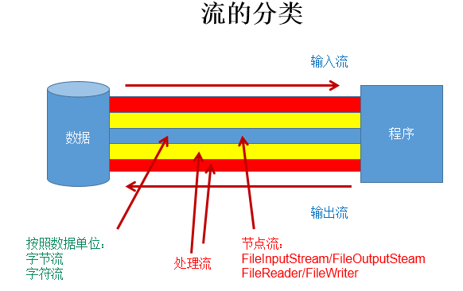
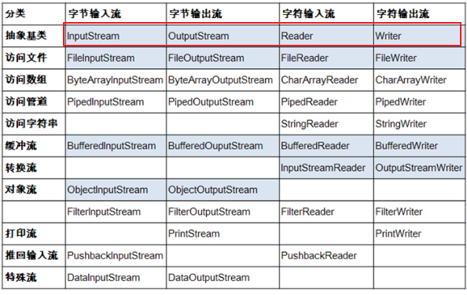
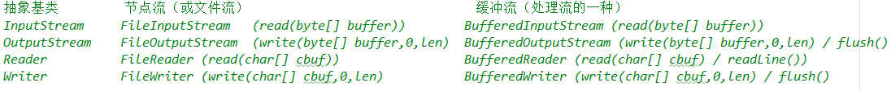

# IO流概述

## 流的分类

1. 操作数据单位：`字节流`、`字符流`
2. 数据的流向：`输入流`、`输出流`
3. 流的角色：`节点流`、`处理流`

图示：

## 流的体系结构

::: info 说明
红框对应的是IO流中的4个抽象基类。

蓝框的流需要大家重点关注。
:::

## 重点说明的几个流结构

## 输入、输出的标准化过程

### 输入过程

1. 创建File类的对象，指明读取的数据的来源。（要求此文件一定要存在）
2. 创建相应的输入流，将File类的对象作为参数，传入流的构造器中
3. 具体的读入过程：
   创建相应的byte[] 或 char[]。
4. 关闭流资源

::: info 说明
程序中出现的异常需要使用`try-catch-finally`处理。
:::

### 输出过程

1. 创建File类的对象，指明写出的数据的位置。（不要求此文件一定要存在）
2. 创建相应的输出流，将File类的对象作为参数，传入流的构造器中
3. 具体的写出过程：`write(char[]/byte[] buffer,0,len)`
4. 关闭流资源

::: info 说明
程序中出现的异常需要使用`try-catch-finally`处理。
:::
