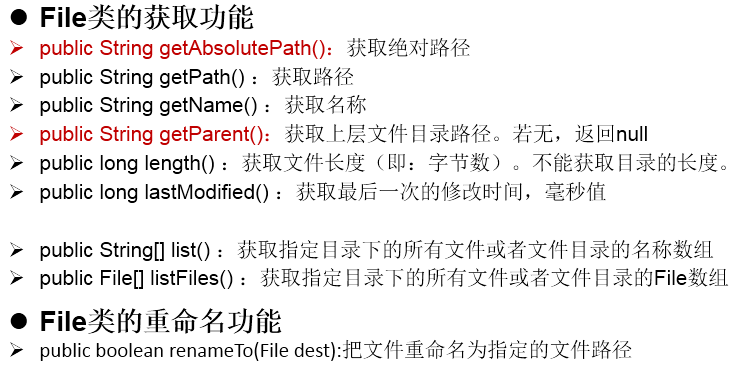
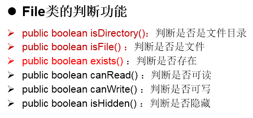
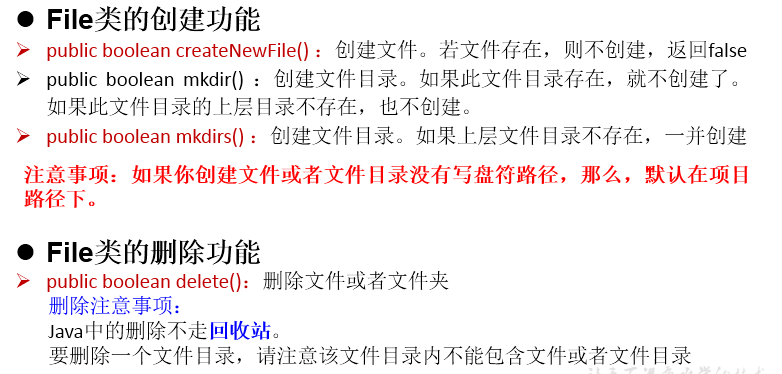

# File类的使用

## File类的理解

1. File类的一个对象，代表一个文件或一个文件目录(俗称：文件夹)
2. File类声明在`java.io`包下
3. File类中涉及到关于文件或文件目录的创建、删除、重命名、修改时间、文件大小等方法，
   并未涉及到写入或读取文件内容的操作。如果需要读取或写入文件内容，必须使用IO流来完成。
4. 后续File类的对象常会作为参数传递到流的构造器中，指明读取或写入的"终点".

## File的实例化

### 常用构造器

```java
File(String filePath)
File(String parentPath,String childPath)
File(File parentFile,String childPath)
```

### 路径的分类

- `相对路径`：相较于某个路径下，指明的路径。
- `绝对路径`：包含盘符在内的文件或文件目录的路径

::: info 说明

- IDEA中：
  如果大家开发使用JUnit中的单元测试方法测试，相对路径即为当前Module下。
  如果大家使用main()测试，相对路径即为当前的Project下。
- Eclipse中：
  不管使用单元测试方法还是使用main()测试，相对路径都是当前的Project下。

:::

### 路径分隔符

windows和DOS系统默认使用"\"来表示

UNIX和URL使用"/"来表示

## File类的常用方法






