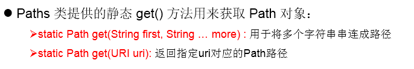
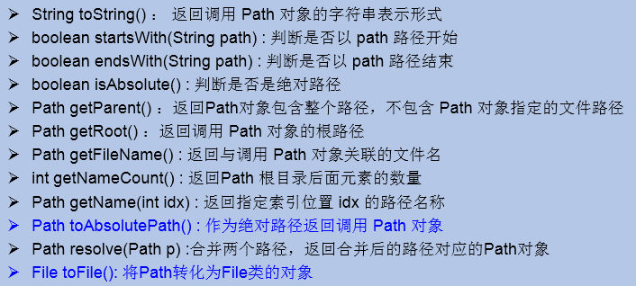
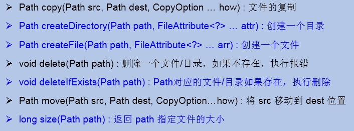
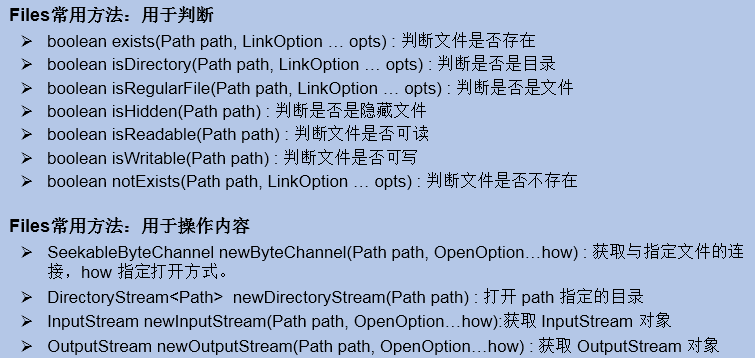

# Path、Paths、Files的使用

## NIO的使用说明

- Java NIO (New IO，Non-Blocking IO)是从Java 1.4版本开始引入的一套新的IO API，可以替代标准的Java IO AP。
- NIO与原来的IO同样的作用和目的，但是使用的方式完全不同，NIO支持面向缓冲区的(IO是面向流的)、基于 通道的IO操作。
- NIO将以更加高效的方式进行文件的读写操作。
- 随着 JDK 7 的发布，Java对NIO进行了极大的扩展，增强了对文件处理和文件系统特性的支持，以至于我们称他们为 NIO.2。

## Path的使用

### Path的说明

Path替换原有的File类。

### 如何实例化

### 常用方法

## Files工具类

### 作用

操作文件或文件目录的工具类

### 常用方法

