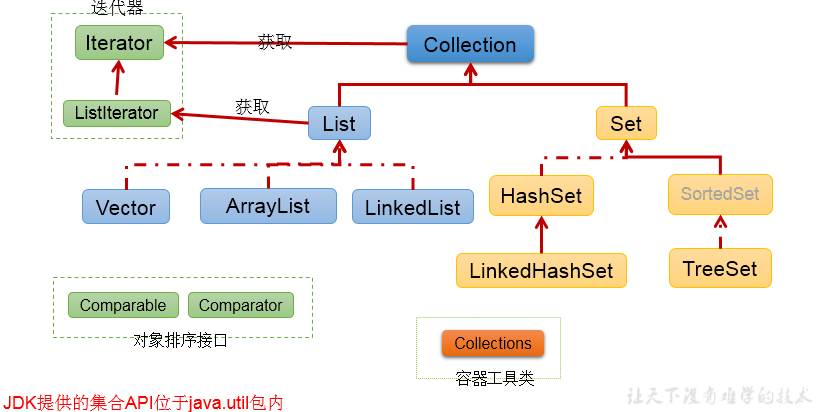

# Collection接口

## 单列集合框架结构

```text
|----Collection接口：单列集合，用来存储一个一个的对象
	|----List接口：存储序的、可重复的数据。  -->"动态"数组
		|----ArrayList、LinkedList、Vector
	|----Set接口：存储无序的、不可重复的数据   -->高中讲的"集合"
		|----HashSet、LinkedHashSet、TreeSet
```

对应图示：



## Collection接口常用方法
```java
add(Object obj),
addAll(Collection coll),
size(),isEmpty(),
clear();

contains(Object obj),
containsAll(Collection coll),
remove(Object obj),
removeAll(Collection coll),
retainsAll(Collection coll),
equals(Object obj);

hasCode(),
toArray(),
iterator();
```
## Collection集合与数组间的转换

集合:arrow_right:数组: `toArray()`

```java
Object[] arr = coll.toArray();
for(int i = 0;i < arr.length;i++){
	System.out.println(arr[i]);
}
```

数组:arrow_right:集合: 调用Arrays类的静态方法`asList(T ... t)`

```java
List<String> list = Arrays.asList(new String[]{"AA", "BB", "CC"});
System.out.println(list);

List arr1 = Arrays.asList(new int[]{123, 456});
System.out.println(arr1.size());//1

List arr2 = Arrays.asList(new Integer[]{123, 456});
System.out.println(arr2.size());//2
```

## 要求

向Collection接口的实现类的对象中添加数据obj时，要求obj所在类要重写equals().
