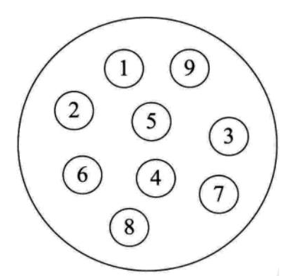
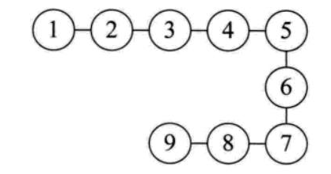
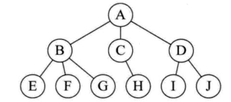
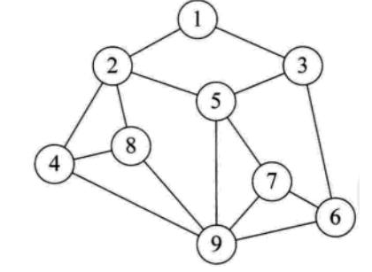

# 数据结构简述

## 数据结构概述

数据结构（Data
Structure是一门和计算机硬件与软件都密切相关的学科，它的研究重点是在计算机的程序设计领域中探讨如何在计算机中组织和存储数据并进行高效率的运用，==涉及的内容包含：数据的逻辑关系、数据的存储结构、排序算法（Algorithm）、查找（或搜索）等。==

## 数据结构与算法的理解

==程序能否快速而高效地完成预定的任务，取决于是否选对了数据结构，而程序是否能清楚而正确地把问题解决，则取决于算法。==

所以大家认为："==Algorithms + Data Structures = Programs=="（出自：Pascal之父Nicklaus Wirth）

::: info 总结
算法是为了解决实际问题而设计的，数据结构是算法需要处理的问题载体。
:::

## 数据结构的研究对象

### 数据间的逻辑结构

集合结构

一对一：线性结构

一对多：树形结构

多对多：图形结构

### 数据的存储结构

线性表（顺序表、链表、栈、队列）

树

图

::: info 说明
习惯上把顺序表和链表看做基本数据结构（或真实数据结构）

习惯上把栈、队列、树、图看做抽象数据类型，简称ADT
:::
