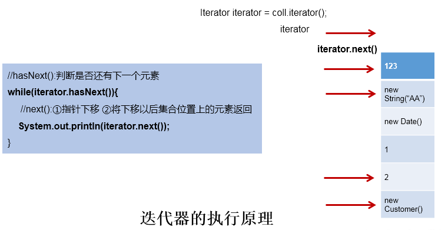

# Iterator接口与foreach循环

## 遍历Collection的两种方式

1. 使用迭代器Iterator
2. foreach循环（或增强for循环）

## Iterator

java.utils包下定义的迭代器接口

### 说明

1. Iterator对象称为迭代器(设计模式的一种)，主要用于遍历 `Collection` 集合中的元素。
2. GOF给迭代器模式的定义为：_提供一种方法访问一个容器(container)
   对象中各个元素，而又不需暴露该对象的内部细节。迭代器模式，就是为容器而生_。

### 作用

遍历集合`Collectiton`元素

### 如何获取实例

coll.iterator()返回一个迭代器实例

### 遍历的代码实现

```java
Iterator iterator = coll.iterator();
//hasNext():判断是否还下一个元素
while(iterator.hasNext()){
	//next():①指针下移 ②将下移以后集合位置上的元素返回
	System.out.println(iterator.next());
}
```

### 图示说明



### remove()的使用

```java
// 测试Iterator中的remove()
// 如果还未调用next()或在上一次调用 next 方法之后已经调用了 remove 方法，再调用remove都会报IllegalStateException。
// 内部定义了remove(),可以在遍历的时候，删除集合中的元素。此方法不同于集合直接调用remove()
@Test
public void test3(){
   Collection coll = new ArrayList();
   coll.add(123);
   coll.add(456);
   coll.add(new Person("Jerry",20));
   coll.add(new String("Tom"));
   coll.add(false);
   
   //删除集合中"Tom"
   Iterator iterator = coll.iterator();
   while (iterator.hasNext()){
      // iterator.remove();
      Object obj = iterator.next();
      if("Tom".equals(obj)){
         iterator.remove();
         // iterator.remove();
      }
   }

   //遍历集合
   iterator = coll.iterator();
   while (iterator.hasNext()){
      System.out.println(iterator.next());
   }
}
```

## 增强for循环

foreach循环

### 遍历集合举例

```java
@Test
public void test1(){
   Collection coll = new ArrayList();
   coll.add(123);
   coll.add(456);
   coll.add(new Person("Jerry",20));
   coll.add(new String("Tom"));
   coll.add(false);
   
   //for(集合元素的类型 局部变量 : 集合对象)
   
   for(Object obj : coll){
      System.out.println(obj);
   }
}
```

::: info 说明
内部仍然调用了迭代器
:::

### 遍历数组举例

```java
@Test
public void test2(){
   int[] arr = new int[]{1,2,3,4,5,6};
   //for(数组元素的类型 局部变量 : 数组对象)
   for(int i : arr){
      System.out.println(i);
   }
}
```
