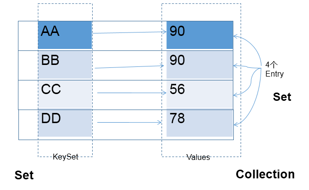

# Map接口

## 常用实现类结构

```text
|----Map:双列数据，存储key-value对的数据   ---类似于高中的函数：y = f(x)
	|----HashMap:作为Map的主要实现类；线程不安全的，效率高；存储null的key和value
		|----LinkedHashMap:保证在遍历map元素时，可以照添加的顺序实现遍历。
			原因：在原的HashMap底层结构基础上，添加了一对指针，指向前一个和后一个元素。
			对于频繁的遍历操作，此类执行效率高于HashMap。
	|----TreeMap:保证照添加的key-value对进行排序，实现排序遍历。此时考虑key的自然排序或定制排序
			底层使用红黑树
	|----Hashtable:作为古老的实现类；线程安全的，效率低；不能存储null的key和value
		|----Properties:常用来处理配置文件。key和value都是String类型
```

::: tip HashMap的底层
数组+链表（jdk7及之前)

数组+链表+红黑树 （jdk 8)
:::

## 存储结构的理解

1. Map中的key:无序的、不可重复的，使用Set存储所的key ---> key所在的类要重写equals()和hashCode() （以HashMap为例)
2. Map中的value:无序的、可重复的，使用Collection存储所的value --->value所在的类要重写equals()
3. 一个键值对：key-value构成了一个Entry对象。
4. Map中的entry:无序的、不可重复的，使用Set存储所的entry

图示：



## 常用方法

```java
添加：put(Object key,Object value)
删除：remove(Object key)
修改：put(Object key,Object value)
查询：get(Object key)
长度：size()
遍历：keySet() / values() / entrySet()
```

## 内存结构说明🔔

### HashMap在jdk7中实现原理

HashMap map = new HashMap()

1. 在实例化以后，底层创建了长度是16的一维数组Entry[] table。
2. ...可能已经执行过多次put...
3. map.put(key1,value1):
	- 首先，调用key1所在类的hashCode()计算key1哈希值，此哈希值经过某种算法计算以后，得到在Entry数组中的存放位置。
	- 如果此位置上的数据为空，此时的key1-value1添加成功。 ----情况1
	- 如果此位置上的数据不为空，(意味着此位置上存在一个或多个数据(以链表形式存在)),比较key1和已经存在的一个或多个数据的哈希值：
		- 如果key1的哈希值与已经存在的数据的哈希值都不相同，此时key1-value1添加成功。----情况2
		- 如果key1的哈希值和已经存在的某一个数据(key2-value2)的哈希值相同，继续比较：调用key1所在类的equals(key2)方法，比较：
			- 如果equals()返回false:此时key1-value1添加成功。----情况3
			- 如果equals()返回true:使用value1替换value2。

::: info 补充
关于情况2和情况3：此时key1-value1和原来的数据以链表的方式存储。
:::
::: tip
在不断的添加过程中，会涉及到扩容问题，当超出临界值(且要存放的位置非空)时，扩容。默认的扩容方式：扩容为原来容量的2倍，并将原的数据复制过来。
:::

### HashMap在jdk8中相较于jdk7在底层实现方面的不同

1. new HashMap():底层没创建一个长度为16的数组
2. jdk 8底层的数组是：Node[],而非Entry[]
3. 首次调用put()方法时，底层创建长度为16的数组
4. jdk7底层结构只：数组+链表。jdk8中底层结构：数组+链表+红黑树。
	- 形成链表时，七上八下（jdk7:新的元素指向旧的元素。jdk8：旧的元素指向新的元素）
	- 当数组的某一个索引位置上的元素以链表形式存在的数据个数 > 8 且当前数组的长度 > 64时，此时此索引位置上的所数据改为使用红黑树存储。

### HashMap底层典型属性的属性的说明

```java
DEFAULT_INITIAL_CAPACITY : HashMap的默认容量，16
DEFAULT_LOAD_FACTOR：HashMap的默认加载因子：0.75
threshold：扩容的临界值，=容量填充因子：16*0.75 => 12
TREEIFY_THRESHOLD：Bucket中链表长度大于该默认值，转化为红黑树:8
MIN_TREEIFY_CAPACITY：桶中的Node被树化时最小的hash表容量:64
```

### LinkedHashMap的底层实现原理(了解)

LinkedHashMap底层使用的结构与HashMap相同，因为LinkedHashMap继承于HashMap.
::: tip 区别就在于
LinkedHashMap内部提供了Entry，替换HashMap中的Node.
:::

## TreeMap的使用

向TreeMap中添加key-value，要求key必须是由同一个类创建的对象

**因为要对key进行排序：自然排序 、定制排序**

## 使用Properties读取配置文件

`Properties`:常用来处理配置文件。key和value都是String类型

```java
public static void main(String[] args)  {
	FileInputStream fis = null;
	try {
		Properties pros = new Properties();
		
		fis = new FileInputStream("jdbc.properties");
		pros.load(fis);//加载流对应的文件
		
		String name = pros.getProperty("name");
		String password = pros.getProperty("password");
		
		System.out.println("name = " + name + ", password = " + password);
	} catch (IOException e) {
		e.printStackTrace();
	} finally {
		if(fis != null){
			try {
				fis.close();
			} catch (IOException e) {
				e.printStackTrace();
			}
		}
	}
}
```

