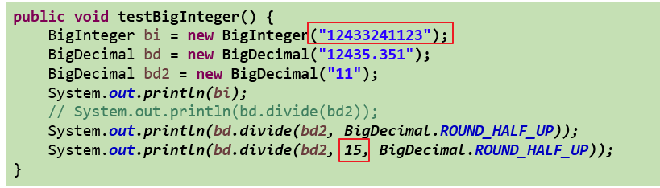

# 其他类

## System类

System类代表系统，系统级的很多属性和控制方法都放置在该类的内部。该类位于`java.lang`包。

由于该类的构造器是`private`的，所以无法创建该类的对象，也就是无法实例化该类。其内部的成员变量和成员方法都是static的，所以也可以很方便的进行调用。

方法：

```java
native long currentTimeMillis()
void exit(int status)
void gc()
String getProperty(String key)
```

## Math类

`java.lang.Math`提供了一系列静态方法用于科学计算。其方法的参数和返回值类型一般为double型。

## BigInteger类、BigDecimal类

1. `java.math`包的`BigInteger`可以表示不可变的任意精度的整数。
2. 要求数字精度比较高，用到`java.math.BigDecimal`类

代码举例：


