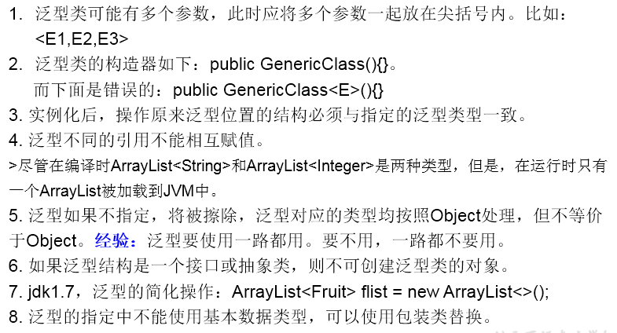
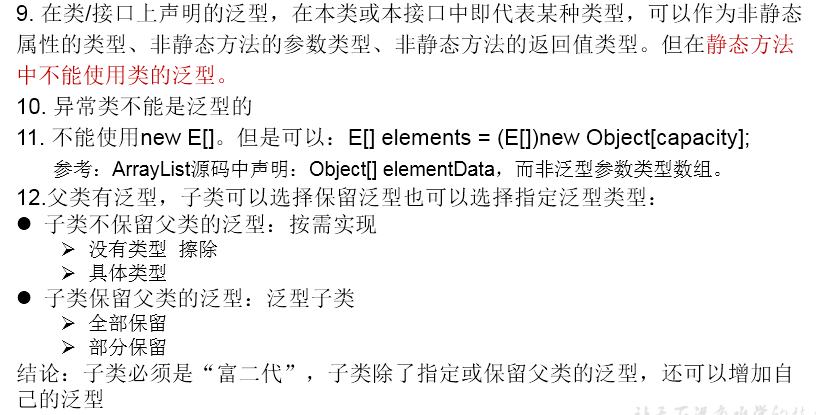

# 自定义泛型类、泛型接口、泛型方法

## Order.java

```java
public class Order<T> {
	String orderName;
	int orderId;
	
	// 类的内部结构就可以使用类的泛型
	
	T orderT;
	
	public Order(){
		// 编译不通过
		// T[] arr = new T[10];
		// 编译通过
		T[] arr = (T[]) new Object[10];
	}
	
	public Order(String orderName,int orderId,T orderT){
		this.orderName = orderName;
		this.orderId = orderId;
		this.orderT = orderT;
	}
	
	// 如下的个方法都不是泛型方法
	public T getOrderT(){
		return orderT;
	}
	
	public void setOrderT(T orderT){
		this.orderT = orderT;
	}
	
	@Override
	public String toString() {
		return "Order{" +
		"orderName='" + orderName + '\'' +
		", orderId=" + orderId +
		", orderT=" + orderT +
		'}';
	}
	// 静态方法中不能使用类的泛型。
	// public static void show(T orderT){
	//      System.out.println(orderT);
	// }
	
	public void show(){
		// 编译不通过
		// try{
		// }catch(T t){
		// }
	}
	
	// 泛型方法：在方法中出现了泛型的结构，泛型参数与类的泛型参数没任何关系。
	// 换句话说，泛型方法所属的类是不是泛型类都没关系。
	// 泛型方法，可以声明为静态的。原因：泛型参数是在调用方法时确定的。并非在实例化类时确定。
	public static <E> List<E> copyFromArrayToList(E[] arr){
	
		ArrayList<E> list = new ArrayList<>();
		
		for(E e : arr){
			list.add(e);
		}
		
		return list;
	}
}
```

## SubOrder.java

```java
public class SubOrder extends Order<Integer> {
	// SubOrder:不是泛型类
	public static <E> List<E> copyFromArrayToList(E[] arr){
	
		ArrayList<E> list = new ArrayList<>();
		
		for(E e : arr){
			list.add(e);
		}
		return list;
	}
}
// 实例化时，如下的代码是错误的
SubOrder<Integer> o = new SubOrder<>();
```

## SubOrder1.java

```java
public class SubOrder1<T> extends Order<T> {//SubOrder1<T>:仍然是泛型类
	
}

// 测试
@Test
public void test1(){
	// 如果定义了泛型类，实例化没指明类的泛型，则认为此泛型类型为Object类型
	// 要求：如果大家定义了类是带泛型的，建议在实例化时要指明类的泛型。
	Order order = new Order();
	order.setOrderT(123);
	order.setOrderT("ABC");
	
	//建议：实例化时指明类的泛型
	Order<String> order1 = new Order<String>("orderAA",1001,"order:AA");
	
	order1.setOrderT("AA:hello");
}

@Test
public void test2(){
	SubOrder sub1 = new SubOrder();
	// 由于子类在继承带泛型的父类时，指明了泛型类型。则实例化子类对象时，不再需要指明泛型。
	sub1.setOrderT(1122);
	
	SubOrder1<String> sub2 = new SubOrder1<>();
	sub2.setOrderT("order2...");
}

@Test
public void test3(){
	ArrayList<String> list1 = null;
	ArrayList<Integer> list2 = new ArrayList<Integer>();
	// 泛型不同的引用不能相互赋值。
	// list1 = list2;
	
	Person p1 = null;
	Person p2 = null;
	p1 = p2;
}

// 测试泛型方法
@Test
public void test4(){
	Order<String> order = new Order<>();
	Integer[] arr = new Integer[]{1,2,3,4};
	// 泛型方法在调用时，指明泛型参数的类型。
	List<Integer> list = order.copyFromArrayToList(arr);
	
	System.out.println(list);
}
```

## 注意点




## 应用场景举例

### DAO.java

定义了操作数据库中的表的通用操作。ORM思想(数据库中的表和Java中的类对应)

```java
public class DAO<T> {
	// 表的共性操作的DAO
	
	// 添加一条记录
	public void add(T t){
	}
	
	// 删除一条记录
	public boolean remove(int index){
		return false;
	}
	
	//修改一条记录
	public void update(int index,T t){
	}
	
	// 查询一条记录
	public T getIndex(int index){
		return null;
	}
	
	// 查询多条记录
	public List<T> getForList(int index){
		return null;
	}
	
	// 泛型方法
	// 举例：获取表中一共有多少条记录？获取最大的员工入职时间？
	public <E> E getValue(){
		return null;
	}
}
```

### CustomerDAO.java

```java
// 只能操作某一个表的DAO
public class CustomerDAO extends DAO<Customer>{
}
```

### StudentDAO.java

```java
// 只能操作某一个表的DAO
public class StudentDAO extends DAO<Student> {
}
```
