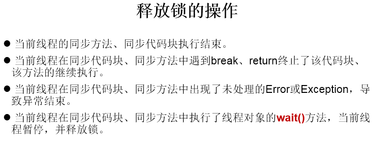
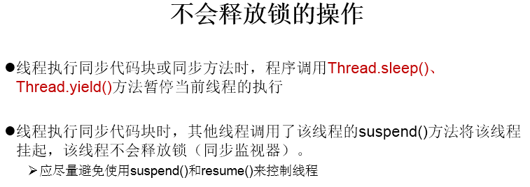

# 线程通信

## 线程通信涉及到的三个方法

- `wait()`: 一旦执行此方法，当前线程就进入阻塞状态，并释放同步监视器。
- `notify()`: 一旦执行此方法，就会唤醒被wait的一个线程。如果有多个线程被wait，就唤醒优先级高的那个。
- `notifyAll()`: 一旦执行此方法，就会唤醒所有被wait的线程。

## 说明

1. `wait()`，`notify()`，`notifyAll()`三个方法必须使用在同步代码块或同步方法中。
2. `wait()`，`notify()`，`notifyAll()`三个方法的调用者必须是同步代码块或同步方法中的同步监视器。否则，会出现==IllegalMonitorStateException异常==
3. wait()，notify()，notifyAll()三个方法是定义在java.lang.Object类中。

## 面试题

sleep() 和 wait()的异同？

1. 相同点：一旦执行方法，都可以使得当前的线程进入阻塞状态。
2. 不同点：
    - 两个方法声明的位置不同：Thread类中声明sleep() , Object类中声明wait()
    - 调用的要求不同：sleep()可以在任何需要的场景下调用。 wait()必须使用在同步代码块或同步方法中
    - 关于是否释放同步监视器：如果两个方法都使用在同步代码块或同步方法中，sleep()不会释放锁，wait()会释放锁。

## 释放锁的操作

## 不会释放锁的操作

