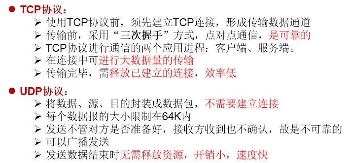
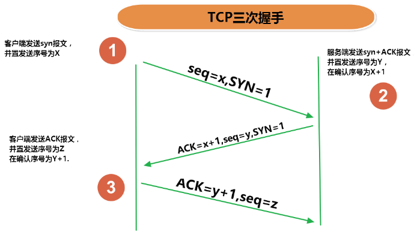
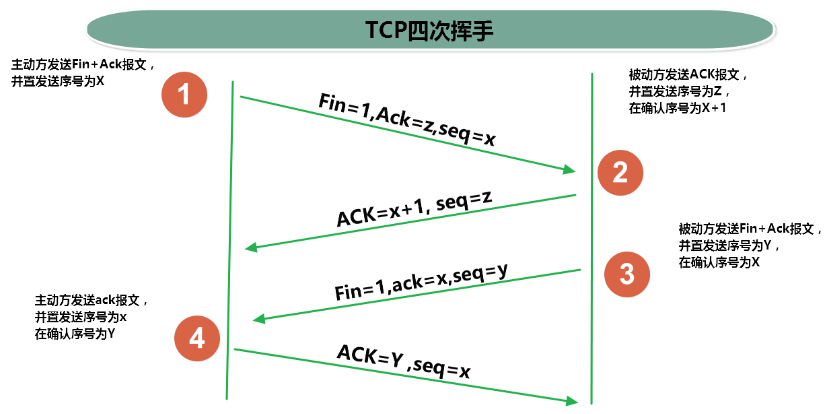

# InetAddress类的使用

## 实现网络通信需要解决的两个问题

1. 如何准确地定位网络上一台或多台主机；定位主机上的特定的应用
2. 找到主机后如何可靠高效地进行数据传输

## 网络通信的两个要素

1. 对应问题一：IP和端口号
2. 对应问题二：提供网络通信协议：TCP/IP参考模型（应用层、传输层、网络层、物理+数据链路层）

## 通信要素一：IP和端口号

### IP的理解

1. IP:唯一的标识 Internet 上的计算机（通信实体）
2. 在Java中使用InetAddress类代表IP
3. IP分类：IPv4 和 IPv6 ; 万维网 和 局域网
4. 域名: www.baidu.com www.mi.com www.sina.com www.jd.com
	- 域名解析：域名容易记忆，当在连接网络时输入一个主机的域名后，域名服务器(DNS)负责将域名转化成IP地址，这样才能和主机建立连接。
5. 本地回路地址：127.0.0.1 对应着：localhost

### InetAddress类

此类的一个对象就代表着一个具体的IP地址

1. 实例化: `getByName(String host)` 、 `getLocalHost()`

2. 常用方法: `getHostName()` / `getHostAddress()`

### 端口号

正在计算机上运行的进程。

1. 要求：不同的进程不同的端口号
2. 范围：被规定为一个 16 位的整数 0~65535。

::: info
端口号与IP地址的组合得出一个网络套接字：Socket
:::

## 通信要素二：网络通信协议

1. 分型模型  
   
2. TCP和UDP的区别  
   
3. TCP三次握手和四次挥手  
     
   
