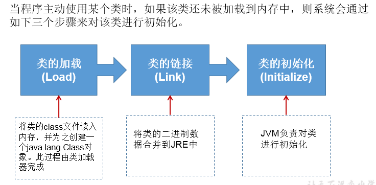
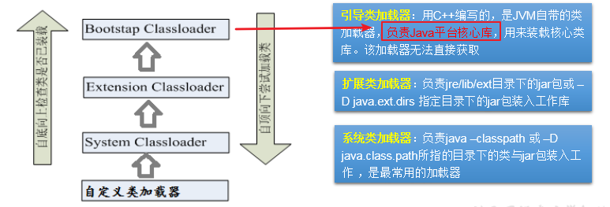
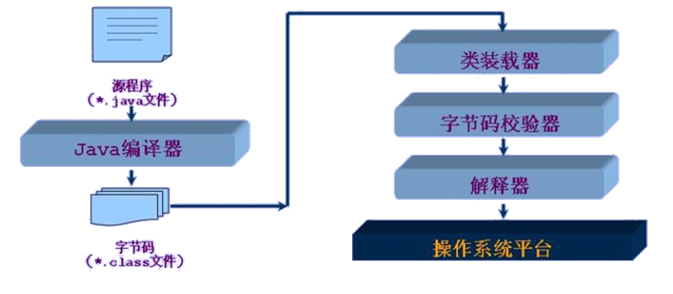

# 了解ClassLoader

## 类的加载过程----了解



## 类的加载器的作用


## 类的加载器的分类



## Java类编译、运行的执行的流程



## 使用Classloader加载src目录下的配置文件

```java
@Test
public void test2() throws Exception {

	Properties pros = new Properties();
	// 此时的文件默认在当前的module下。
	// 读取配置文件的方式一：
	// FileInputStream fis = new FileInputStream("jdbc.properties");
	// FileInputStream fis = new FileInputStream("src\\jdbc1.properties");
	// pros.load(fis);
	
	// 读取配置文件的方式二：使用ClassLoader
	// 配置文件默认识别为：当前module的src下
	ClassLoader classLoader = ClassLoaderTest.class.getClassLoader();
	InputStream is = classLoader.getResourceAsStream("jdbc1.properties");
	pros.load(is);
	
	String user = pros.getProperty("user");
	String password = pros.getProperty("password");
	System.out.println("user = " + user + ",password = " + password);
}
```
