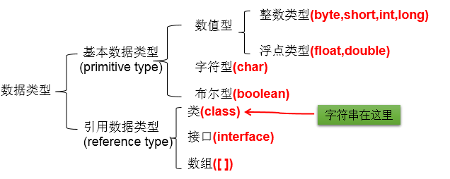
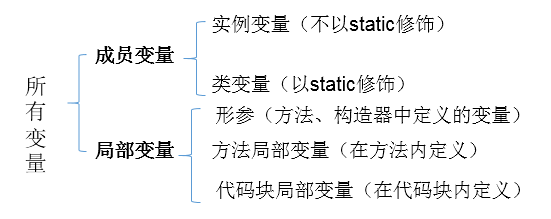
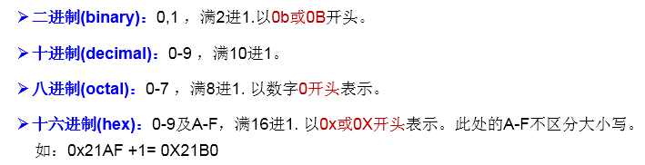
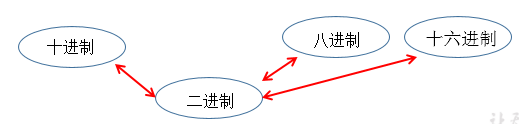
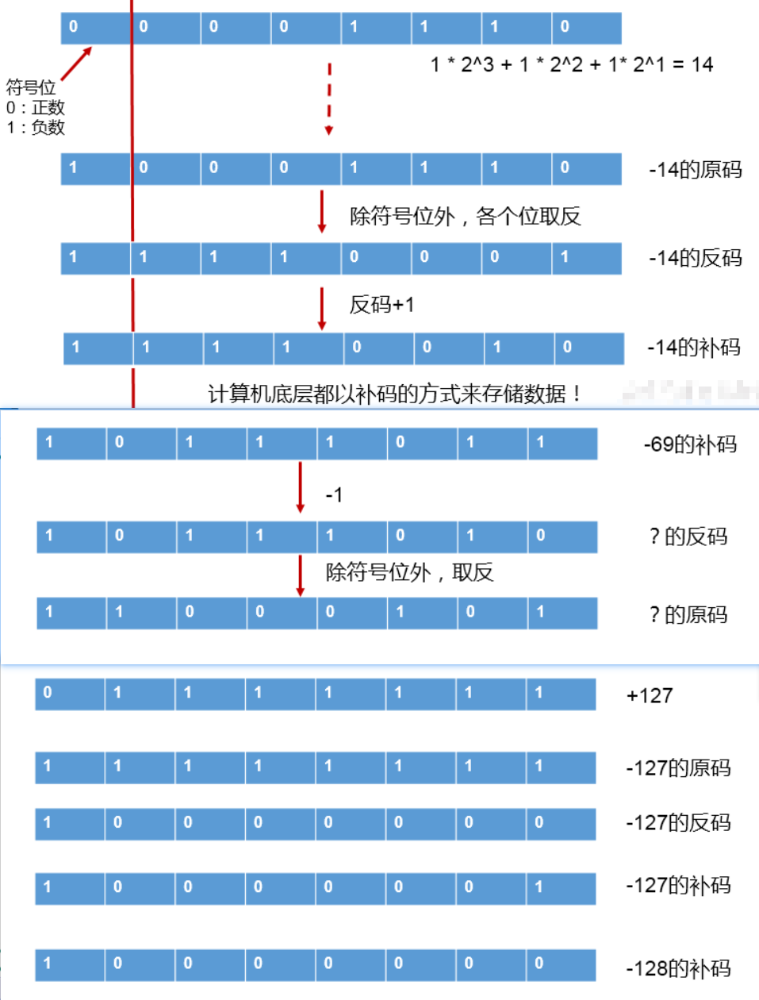
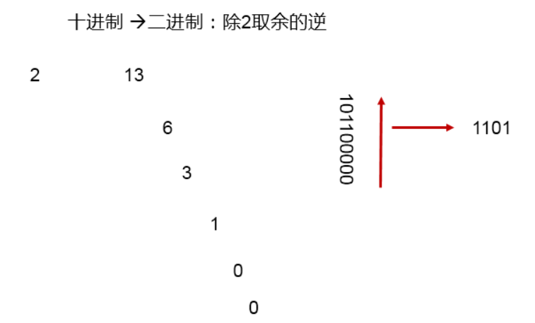
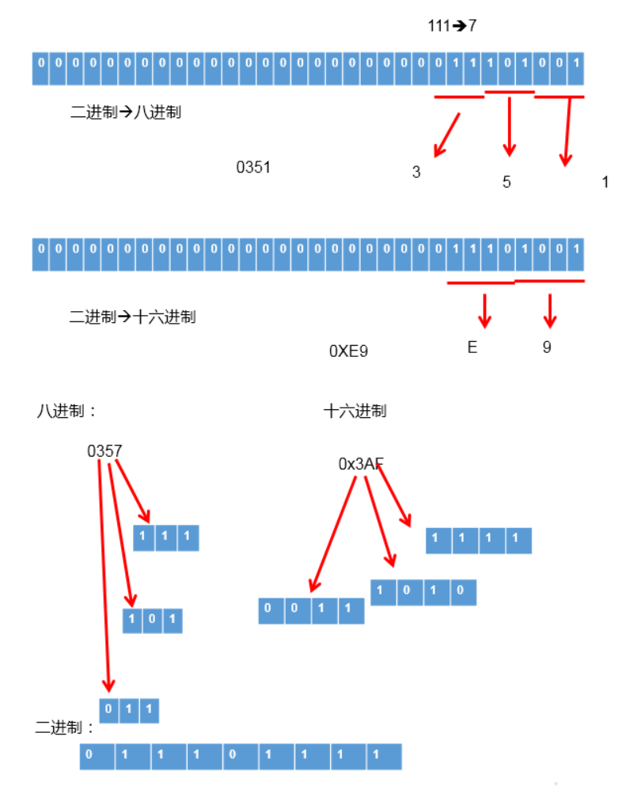

# 基本语法

## 关键字与标识符

### 1.JAVA关键字的使用

**定义**：被Java语言赋予了特殊含义，用做专门用途的字符串（单词）

**特点**：关键字中所字母都为小写

具体哪些关键字：

1. 用于定义数据类型的关键字：   
   `class`、`interface`、`enum`、`byte`、`short`、`int`、`lang`、`float`、`double`、`char`、`boolean`、`void`
2. 用于定义流程控制的关键字：  
   `if`、`else`、`switch`、`case`、`default`、`while`、`do`、`for`、`break`、`continue`、`return`
3. 用于定义访问权限修饰符的关键字：  
   `private`、`protected`、`public`
4. 用于定义类、函数、变量修饰符的关键字：  
   `abstract`、`final`、`static`、`synchronized`
5. 用于定义类与类之间关系的关键字：  
   `extends`、`implements`
6. 用于定义建立实例与类之间关系的关键字：  
   `new`、`this`、`super`、`instanceof`
7. 用于异常处理的关键字：  
   `try`、`catch`、`finally`、`throw`、`throws`
8. 用于包的关键字：
   `package`、`import`
9. 其它修饰符关键字：
   `native`、`strictfp`、`transient`、`volatile`、`assert`
10. 用于定义数据类型值的字面值：
    `true`、`false`、`null`

### 2.标识符的使用

**定义**：凡是自己可以起名字的地方都叫标识符。

涉及到的结构：

`包名`、`类名`、`接口名`、`变量名`、`方法名`、`常量名`

**规则**：
::: danger 必须要遵守。否则，编译不通过

- 由26个英文字母大小写,0-9,_或$组成
- 数字不可以开头
- 不可以使用关键字和保留字,但能包含关键字和保留字
- Java中严格区分大小写,长度无限制
- 标识符不能包含空格
  :::
  **规范**：
  ::: tip 可以不遵守，不影响编译和运行。但是要求大家遵守
- **包名**：多单词组成时所有字母都小写：`xxxyyyzzz`
- **类名**、接口名：多单词组成时,所有单词的首字母大写：`XxxYyyZzz`
- **变量名**、方法名：多单词组成时,第一个单词首字母小写,第二个单词开始每个单词首字母大写：`xxxYyyZzz`
- **常量名**：所有字母都大写。多单词时每个单词用下划线连接：`XXX_YYY_ZZZ`
  :::

**注意点**：在起名字时，为了提高阅读性，要尽量有意义，**"见名知意"**。

## <font color=red>变量的使用(重点🔖)</font>

### 1.变量的分类

- **1.1 按数据类型分类**：  
  

*详细说明*：

1. 整型：byte(1字节=8bit) \ short(2字节) \ int(4字节) \ long(8字节)
    1. byte范围：-128 ~ 127
    2. 声明long型变量，必须以"l"或"L"结尾
    3. 通常，定义整型变量时，使用int型。
    4. 整型的常量，默认类型是：int型
2. 浮点型：float(4字节) \ double(8字节)
    1. 浮点型，表示带小数点的数值
    2. float表示数值的范围比long还大
    3. 定义float类型变量时，变量要以"f"或"F"结尾
    4. 通常，定义浮点型变量时，使用double型。
    5. 浮点型的常量，默认类型为：double
3. 字符型：char (1字符=2字节)
    1. 定义char型变量，通常使用一对'',内部只能写一个字符
    2. 表示方式：
        - 声明一个字符
        - 转义字符
        - 直接使用Unicode值来表示字符型常量
4. 布尔型：boolean
    1. 只能取两个值之一：true 、 false
    2. 常常在条件判断、循环结构中使用

- **1.2 按声明位置分类**：  
  

### 2.定义变量的格式

```
数据类型  变量名 = 变量值;
或
数据类型  变量名;
变量名 = 变量值;
```

### 3.变量使用的注意点

- **变量必须先声明，后使用**
- **变量都定义在其作用域内。在作用域内，它是有效的。换句话说，出了作用域，就失效了**
- **同一个作用域内，不可以声明两个同名的变量**

### 4.基本数据类型变量间运算规则

1. 涉及到的基本数据类型：除了boolean之外的其他7种
2. 自动类型转换(只涉及7种基本数据类型）  
   **结论**：当容量小的数据类型的变量与容量大的数据类型的变量做运算时，结果自动提升为容量大的数据类型。
   byte 、char 、short --> int --> long --> float --> double  
   **特别的**：当byte、char、short三种类型的变量做运算时，结果为int型  
   **说明**：此时的容量大小指的是，表示数的范围的大和小。比如：float容量要大于long的容量

3. 强制类型转换(只涉及7种基本数据类型）：自动类型提升运算的逆运算。
    1. 需要使用强转符：`()`
    2. 注意点：强制类型转换，可能导致精度损失。
4. String与8种基本数据类型间的运算
    1. String属于引用数据类型,翻译为：字符串
    2. 声明String类型变量时，使用一对`""`
    3. String可以和8种基本数据类型变量做运算，且运算只能是连接运算：`+`
    4. 运算的结果仍然是String类型
   ```java
    // 避免：
    String s = 123;//编译错误
    String s1 = "123";
    int i = (int)s1;//编译错误
   ```

## <font color=grey>进制(了解)</font>

1. 编程中涉及的进制及表示方式：  
   
2. 二进制的使用说明：
    1. 计算机底层的存储方式：所有数字在计算机底层都以**二进制**形式存在。
    2. 二进制数据的存储方式：所有的数值，不管正负，底层都以补码的方式存储。
    3. 原码、反码、补码的说明：  
       正数：三码合一  
       负数：  
       
3. 进制间的转换：
    1. 图示：  
       
    2. 图示二进制转换为十进制：  
       
    3. 图示十进制转换为二进制：  
       
    4. 二进制与八进制、十六进制间的转换：  
       

## 运算符

1. 算术运算符： `+` `-` `*` `/` `%` `(前)++` `(后)++` `(前)--` `(后)--`
2. 赋值运算符：`=` `+=` `-=` `*=` `/=` `%=`
3. 比较运算符（关系运算符）：`==` `!=` `>` `<` `>=` `<=` `instanceof`
4. 逻辑运算符：`&` `&&` `|` `||` `!` `^`
5. 位运算符：`<<` `>>` `>>>` `&` `|` `^` `~`
6. 三元运算符：`(条件表达式) ? 表达式1 : 表达式2`

## 流程控制

1. if-else条件判断结构
    ```java
    // 结构一：
    if (条件表达式) {
        执行表达式
    }
    
    // 结构二：二选一
    if (条件表达式) {
        执行表达式1
    } else {
        执行表达式2
    }
    
    // 结构三：n选一
    if (条件表达式) {
        执行表达式1
    } else if (条件表达式) {
        执行表达式2
    } else if (条件表达式) {
        执行表达式3
    }
    ...
    else {
        执行表达式n
    }
    ```
   ::: tip 说明
    1. else 结构是可选的。
    2. 针对于条件表达式：
        - 如果多个条件表达式之间是“互斥”关系(或没有交集的关系),哪个判断和执行语句声明在上面还是下面，无所谓。
        - 如果多个条件表达式之间有交集的关系，需要根据实际情况，考虑清楚应该将哪个结构声明在上面。
        - 如果多个条件表达式之间有包含的关系，通常情况下，需要将范围小的声明在范围大的上面。否则，范围小的就没机会执行了。
    3. if-else结构是可以相互嵌套的。
    4. 如果if-else结构中的执行语句只有一行时，对应的一对{}可以省略的。但是，不建议大家省略。

2. switch-case选择结构
    ```java
    switch (表达式) {
        case 常量1:
        执行语句1;
        //break;
        case 常量2:
        执行语句2;
        //break;
        ...
        default:
        执行语句n;
        //break;
    }
    ```
   ::: tip 说明
    1. 根据switch表达式中的值，依次匹配各个case中的常量。一旦匹配成功，则进入相应case结构中，调用其执行语句。
       当调用完执行语句以后，则仍然继续向下执行其他case结构中的执行语句，直到遇到break关键字或此switch-case结构
       末尾结束为止。
    2. break,可以使用在switch-case结构中，表示一旦执行到此关键字，就跳出switch-case结构
    3. switch结构中的表达式，只能是如下的6种数据类型之一：
       byte 、short、char、int、枚举类型(JDK5.0新增)、String类型(JDK7.0新增)
    4. case 之后只能声明常量。不能声明范围。
    5. break关键字是可选的。
    6. default:相当于if-else结构中的else.

3. 循环结构的四要素
    1. 初始化条件
    2. 循环条件 <Badge type="tip" text="boolean" vertical="middle" />
    3. 循环体
    4. 迭代条件
    ```java
    // 三种循环结构：
    // for循环结构
    for (①; ②; ④) {
        ③
    }
    // 执行过程：① - ② - ③ - ④ - ② - ③ - ④ - ... - ②
    
    // while循环结构
    ①
    while (②) {
        ③;
        ④;
    }
    执行过程：① - ② - ③ - ④ - ② - ③ - ④ - ... - ②
   
    // do-while循环结构
    ①
    do {
        ③;
        ④;
    } while(②);
    执行过程：① - ③ - ④ - ② - ③ - ④ - ... - ②
   
    // "无限循环"结构: 
    while(true) 
    // 或 
    for(;;)
    ```

