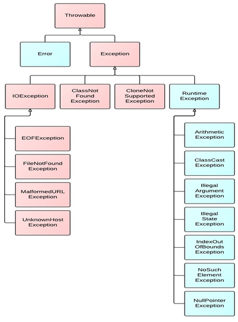
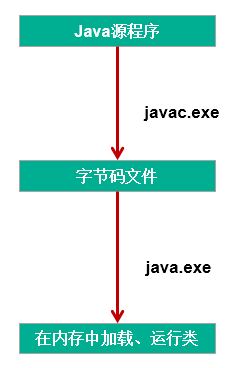

# 异常处理

## 异常

### 异常的体系结构

```text
 java.lang.Throwable
 	|-----java.lang.Error:一般不编写针对性的代码进行处理。
 	|-----java.lang.Exception:可以进行异常的处理
 		|------编译时异常(checked)
 			|-----IOException
 				|-----FileNotFoundException
 			|-----ClassNotFoundException
 		|------运行时异常(unchecked,RuntimeException)
 			|-----NullPointerException
 			|-----ArrayIndexOutOfBoundsException
 			|-----ClassCastException
 			|-----NumberFormatException
 			|-----InputMismatchException
 			|-----ArithmeticException
```



### 异常对比



`编译时异常`：执行javac.exe命名时，可能出现的异常

`运行时异常`：执行java.exe命名时，出现的异常

### 常见的异常类型

运行时异常

```java
    // ArithmeticException
    @Test
    public void test6() {
        int a = 10;
        int b = 0;
        System.out.println(a / b);
    }

    // InputMismatchException
    @Test
    public void test5() {
        Scanner scanner = new Scanner(System.in);
        int score = scanner.nextInt();
        System.out.println(score);

        scanner.close();
    }

    // NumberFormatException
    @Test
    public void test4() {

        String str = "123";
        str = "abc";
        int num = Integer.parseInt(str);


    }

    // ClassCastException
    @Test
    public void test3() {
        Object obj = new Date();
        String str = (String) obj;
    }

    // IndexOutOfBoundsException
    @Test
    public void test2() {
        // ArrayIndexOutOfBoundsException
	    int[] arr = new int[10];
	    System.out.println(arr[10]);
	    
        // StringIndexOutOfBoundsException
        String str = "abc";
        System.out.println(str.charAt(3));
    }

    // NullPointerException
    @Test
    public void test1() {

		int[] arr = null;
		System.out.println(arr[3]);

        String str = "abc";
        str = null;
        System.out.println(str.charAt(0));

    }
```

编译时异常

```java
    @Test
    public void test7() {
        File file = new File("hello.txt");
        FileInputStream fis = new FileInputStream(file);

        int data = fis.read();
        while (data != -1) {
            System.out.print((char) data);
            data = fis.read();
        }
        fis.close();
    }
```

## 异常的处理

### java异常处理的抓抛模型

1. `抛`：程序在正常执行的过程中，一旦出现异常，就会在异常代码处生成一个对应异常类的对象。并将此对象抛出。一旦抛出对象以后，其后的代码就不再执行。
   ::: tip 关于异常对象的产生
	
	- 系统自动生成的异常对象
	- 手动的生成一个异常对象，并抛出（`throw`）

   :::

2. `抓`：可以理解为异常的处理方式：
	- `try-catch-finally`
	- `throws`

### 处理方式一

`try-catch-finally`

```java
    try {
        //可能出现异常的代码
    } catch (异常类型1 变量名1) {
        //处理异常的方式1
    } catch (异常类型2 变量名2) {
        //处理异常的方式2
    } catch (异常类型3 变量名3) {
        //处理异常的方式3
    }
    ....
    } finally {
        //一定会执行的代码
    }
```

::: info 说明

1. finally是可的。
2. 使用try将可能出现异常代码包装起来，在执行过程中，一旦出现异常，就会生成一个对应异常类的对象，根据此对象的类型，去catch中进行匹配
3. 一旦try中的异常对象匹配到某一个catch时，就进入catch中进行异常的处理。一旦处理完成，就跳出当前的try-catch结构（在没写finally的情况。继续执行其后的代码
4. catch中的异常类型如果没子父类关系，则谁声明在上，谁声明在下无所谓。catch中的异常类型如果满足子父类关系，则要求子类一定声明在父类的上面。否则，报错
5. 常用的异常对象处理的方式： ① String getMessage()    ② printStackTrace()
6. 在try结构中声明的变量，再出了try结构以后，就不能再被调用
7. try-catch-finally结构可以嵌套

:::
::: info 如何看待代码中的编译时异常和运行时异常？
体会1：使用`try-catch-finally`
处理编译时异常，是得程序在编译时就不再报错，但是运行时仍可能报错。相当于我们使用`try-catch-finally`将一个编译时可能出现的异常，延迟到运行时出现。

体会2：开发中，由于运行时异常比较常见，所以我们通常就不针对运行时异常编写`try-catch-finally`了。针对于编译时异常，我们说一定要考虑异常的处理。
:::

### 处理方式二

`throws + 异常类型`写在方法的声明处。指明此方法执行时，可能会抛出的异常类型。
一旦当方法体执行时，出现异常，仍会在异常代码处生成一个异常类的对象，此对象满足`throws`后异常类型时，就会被抛出。异常代码后续的代码，就不再执行！

### 对比两种处理方式

`try-catch-finally`: 真正的将异常给处理掉了。
`throws`的方式只是将异常抛给了方法的调用者。并没真正将异常处理掉。

### 如何选择

1. 如果父类中被重写的方法没`throws`
   方式处理异常，则子类重写的方法也不能使用throws，意味着如果子类重写的方法中异常，必须使用`try-catch-finally`方式处理。
2. 执行的方法a中，先后又调用了另外的几个方法，这几个方法是递进关系执行的。我们建议这几个方法使用`throws`
   的方式进行处理。而执行的方法a可以考虑使用`try-catch-finally`方式进行处理。

::: info 补充:方法重写的规则之一
子类重写的方法抛出的异常类型不大于父类被重写的方法抛出的异常类型
:::

## 手动抛出异常对象

### 使用说明

在程序执行中，除了自动抛出异常对象的情况之外，我们还可以手动的throw一个异常类的对象。

### 面试题

`throw` 和 `throws`区别：

`throw` 表示抛出一个异常类的对象，生成异常对象的过程。声明在方法体内。

`throws` 属于异常处理的一种方式，声明在方法的声明处。

### 典型例题

```java
class Student {
   private int id;

   public void regist(int id) throws Exception {
      if (id > 0) {
         this.id = id;
      } else {
         // 手动抛出异常对象
         throw new RuntimeException("您输入的数据非法！");
         throw new Exception("您输入的数据非法！");
         throw new MyException("不能输入负数");
      }
   }

   @Override
   public String toString() {
      return "Student [id=" + id + "]";
   }
}
```

## 自定义异常类

```java
public class MyException extends Exception{
   static final long serialVersionUID = -7034897193246939L;
   public MyException(){
   }
   public MyException(String msg){
      super(msg);
   }
}
```
