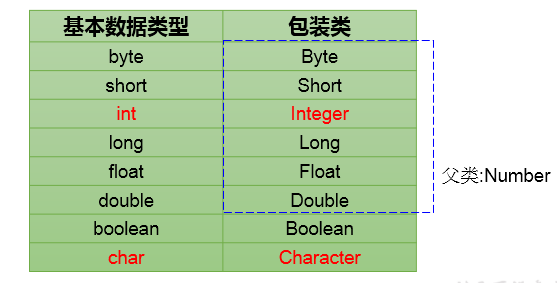
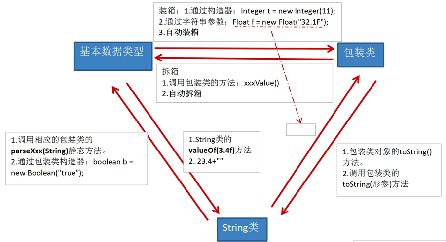

# 包装类的使用
## 为什么要有包装类(或封装类）
为了使基本数据类型的变量具有类的特征，引入包装类。

## 基本数据类型与对应的包装类

## 需要掌握的类型间的转换
基本数据类型、包装类、String  

::: info 简易版
基本数据类型<--->包装类：JDK 5.0 新特性：自动装箱 与自动拆箱
基本数据类型、包装类--->String:调用String重载的valueOf(Xxx xxx)
String--->基本数据类型、包装类:调用包装类的parseXxx(String s)
:::
::: warning 注意
转换时，可能会报NumberFormatException
:::

应用场景举例：
`Vector`类中关于添加元素，只定义了形参为`Object`类型的方法：
> v.addElement(Object obj);   

