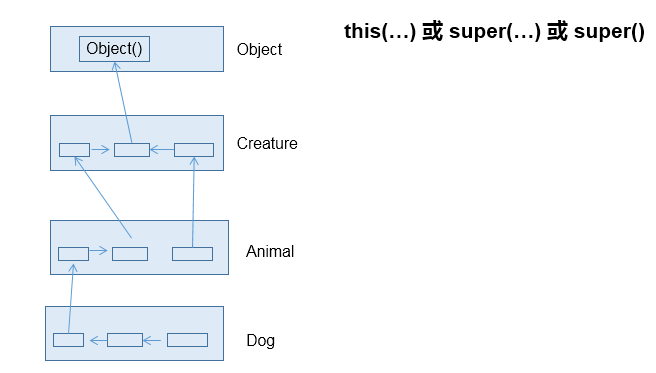
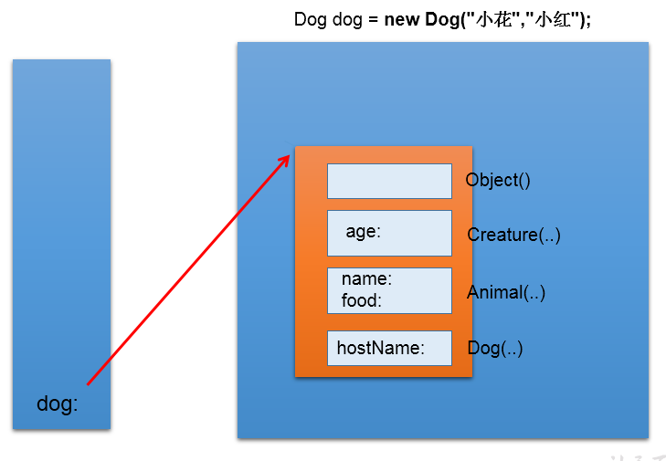

# 子类对象实例化全过程

理解即可

1. 从结果上看：继承性

   子类继承父类以后，就获取了父类中声明的属性或方法。

   创建子类的对象，在堆空间中，就会加载所父类中声明的属性。

2. 从过程上看：
   当我们通过子类的构造器创建子类对象时，我们一定会直接或间接的调用其父类的构造器，进而调用父类的父类的构造器，...直到调用了`java.lang.Object`
   类中空参的构造器为止。正因为加载过所的父类的结构，所以才可以看到内存中父类中的结构，子类对象才可以考虑进行调用。

   
3. 强调说明
   虽然创建子类对象时，调用了父类的构造器，但是自始至终就创建过一个对象，即为`new`的子类对象。
   
