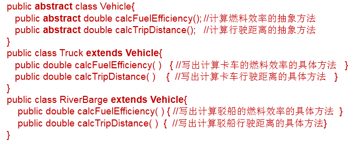
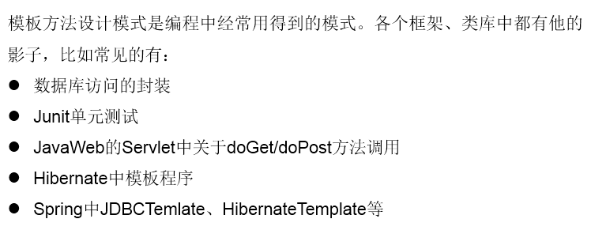

# 关键字：abstract

`abstract`: 抽象的

## 可以用来修饰

类、方法

## 具体

### 修饰类：抽象类

1. 此类不能实例化
2. 抽象类中一定有构造器，便于子类实例化时调用（涉及：子类对象实例化的全过程）
3. 开发中，都会提供抽象类的子类，让子类对象实例化，完成相关的操作 --->抽象的使用前提：继承性

### 修饰方法：抽象方法

1. 抽象方法只方法的声明，没方法体
2. 包含抽象方法的类，一定是一个抽象类。反之，抽象类中可以没有抽象方法的。
3. 若子类重写了父类中的所的抽象方法后，此子类方可实例化
4. 若子类没重写父类中的所的抽象方法，则此子类也是一个抽象类，需要使用abstract修饰

## 注意点

1. abstract不能用来修饰：属性、构造器等结构
2. abstract不能用来修饰私方法、静态方法、final的方法、final的类

## abstract的应用举例

举例一：



举例二：

```java
abstract class GeometricObject{
    public abstract double findArea();
    }
    class Circle extends GeometricObject{
        private double radius;
        public double findArea(){
            return 3.14 * radius * radius;
    };
}
```

举例三：
IO流中设计到的抽象类：`InputStream` / `OutputStream` / `Reader` / `Writer`

在其内部定义了抽象的`read()`、`write()`方法。

## 模板方法的设计模式

1. 解决的问题
   ::: tip
   在软件开发中实现一个算法时，整体步骤很固定、通用，这些步骤已经在父类中写好了。但是某些部分易变，易变部分可以抽象出来，供不同子类实现。这就是一种模板模式。
   :::
2. 举例
    ```java
    abstract class Template{
       // 计算某段代码执行所需要花费的时间
       public void spendTime(){
            long start = System.currentTimeMillis();
            
            this.code();//不确定的部分、易变的部分
            
            long end = System.currentTimeMillis();
            
            System.out.println("花费的时间为：" + (end - start));
       }
       public abstract void code();
    }
    
    class SubTemplate extends Template{
        @Override
        public void code() {
            for(int i = 2;i <= 1000;i++){
                boolean isFlag = true;
                for(int j = 2;j <= Math.sqrt(i);j++){
                    if(i % j == 0){
                        isFlag = false;
                        break;
                    }
                }
                if(isFlag){
                    System.out.println(i);
                }
            }
        }
    }
    ```
3. 应用场景

