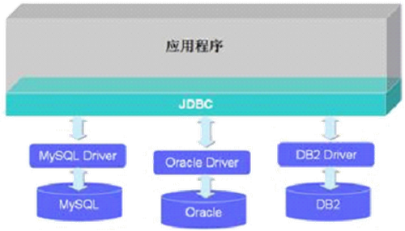

# 关键字：interface

`interface`:接口

## 使用说明

1. 接口使用interface来定义
2. Java中，接口和类是并列的两个结构
3. 如何定义接口：定义接口中的成员
   ::: tip JDK7及以前

   只能定义全局常量和抽象方法
    - 全局常量：`public static final`的.但是书写时，可以省略不写
    - 抽象方法：`public abstract`的

   :::
   ::: tip JDK8
   除了定义全局常量和抽象方法之外，还可以定义静态方法、默认方法（略)
   :::

4. 接口中不能定义构造器的！意味着接口不可以实例化

5. Java开发中，接口通过让类去实现(implements)的方式来使用.

   如果实现类覆盖了接口中的所抽象方法，则此实现类就可以实例化

   如果实现类没覆盖接口中所的抽象方法，则此实现类仍为一个抽象类

6. Java类可以实现多个接口 --->弥补了Java单继承性的局限性

   格式：
   ```java
   class AA extends BB implements CC,DD,EE
   ```
7. 接口与接口之间可以继承，而且可以多继承
8. 接口的具体使用，体现多态性
9. 接口，实际上可以看做是一种规范

## 举例

```java
class Computer{
   public void transferData(USB usb){//USB usb = new Flash();
	  usb.start();
	  System.out.println("具体传输数据的细节");
	  usb.stop();
   }
}

interface USB{
   // 常量：定义了长、宽、最大最小的传输速度等
   void start();
   void stop();
}

class Flash implements USB{
   @Override
   public void start() {
      System.out.println("U盘开启工作");
   }

   @Override
   public void stop() {
      System.out.println("U盘结束工作");
   }
}

class Printer implements USB{
   @Override
   public void start() {
   System.out.println("打印机开启工作");
   }

   @Override
   public void stop() {
      System.out.println("打印机结束工作");
   }
}
```

::: info 体会

1. 接口使用上也满足多态性
2. 接口，实际上就是定义了一种规范
3. 开发中，体会面向接口编程！

:::

## 体会面向接口编程的思想


::: tip 面向接口编程
我们在应用程序中，调用的结构都是JDBC中定义的接口，不会出现具体某一个数据库厂商的API。
:::

## Java8中关于接口的新规范

1. 接口中定义的静态方法，只能通过接口来调用。

2. 通过实现类的对象，可以调用接口中的默认方法。
   如果实现类重写了接口中的默认方法，调用时，仍然调用的是重写以后的方法

3. 如果子类(或实现类)
   继承的父类和实现的接口中声明了同名同参数的默认方法，那么子类在没重写此方法的情况下，默认调用的是父类中的同名同参数的方法。-->
   类优先原则
4. 如果实现类实现了多个接口，而这多个接口中定义了同名同参数的默认方法，
   那么在实现类没重写此方法的情况下，报错。-->接口冲突。
   这就需要我们必须在实现类中重写此方法
5. 如何在子类(或实现类)的方法中调用父类、接口中被重写的方法

   ```java
   public void myMethod() {
        // 调用自己定义的重写的方法
        method3();
        // 调用的是父类中声明的
        super.method3();
        // 调用接口中的默认方法
        CompareA.super.method3();
        CompareB.super.method3();
    }
   ```

## [代理模式](/java/design-patterns/agent.md)
## [工厂模式](/java/design-patterns/factory.md)
