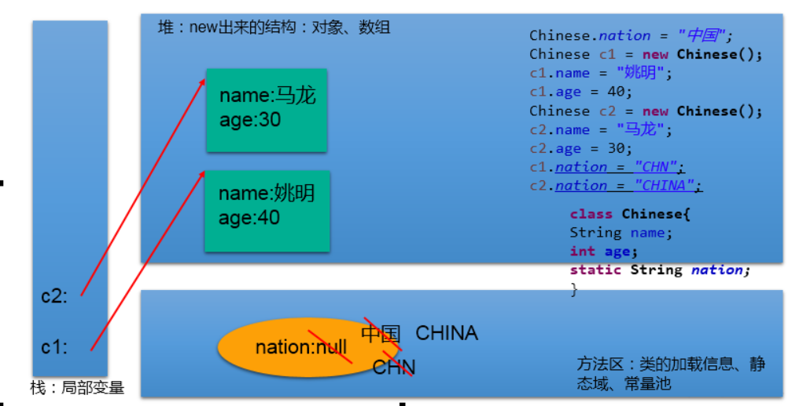

# 关键字：static

`static`: **静态的**

## 可以用来修饰的结构

主要用来修饰类的内部结构  
`属性`、`方法`、`代码块`、`内部类`

## static修饰属性：静态变量（或类变量）

1. 属性，是否使用static修饰，又分为：`静态属性` vs `非静态属性`(`实例变量`)
    - `实例变量`：我们创建了类的多个对象，每个对象都独立的拥一套类中的非静态属性。当修改其中一个对象中的非静态属性时，不会导致其他对象中同样的属性值的修改。
    - `静态变量`：我们创建了类的多个对象，多个对象共享同一个静态变量。当通过某一个对象修改静态变量时，会导致其他对象调用此静态变量时，是修改过了的。
2. static修饰属性的其他说明
    - 静态变量随着类的加载而加载。可以通过`类.静态变量`的方式进行调用
    - 静态变量的加载要早于对象的创建。
    - 由于类只会加载一次，则静态变量在内存中也只会存在一份：存在方法区的静态域中。

3. 静态属性举例：`System.out`; `Math.PI`;

## 静态变量内存解析



## static修饰方法：静态方法、类方法

1. 随着类的加载而加载，可以通过`类.静态方法`的方式进行调用
2. 静态方法 非静态方法

3. 静态方法中，只能调用静态的方法或属性
   非静态方法中，既可以调用非静态的方法或属性，也可以调用静态的方法或属性

## static的注意点

1. 在静态的方法内，不能使用`this`关键字、`super`关键字
2. 关于静态属性和静态方法的使用，大家都从生命周期的角度去理解。

## 如何判定属性和方法应该使用static关键字

1. 关于属性
    - 属性是可以被多个对象所共享的，不会随着对象的不同而不同的。
    - 类中的常量也常常声明为static

2. 关于方法
    - 操作静态属性的方法，通常设置为static的
    - 工具类中的方法，习惯上声明为static的。 比如：Math、Arrays、Collections

## 使用举例

- 举例一：Arrays、Math、Collections等工具类
- 举例二：[单例模式](/Blog/java/java-basic/object/lower/single.html)
- 举例三：

```java
class Circle{
	private double radius;
	// 自动赋值
	private int id;
	
	public Circle(){
		id = init++;
		total++;
	}
	
	public Circle(double radius){
		 this();
         // id = init++;
         // total++;
         this.radius = radius;
	}
	// 记录创建的圆的个数
	private static int total;
	// static声明的属性被所对象所共享
	private static int init = 1001;
	
	public double findArea(){
		 return 3.14 * radius * radius;
	}

	public double getRadius() {
		 return radius;
	}

	public void setRadius(double radius) {
		 this.radius = radius;
	}

	public int getId() {
		 return id;
	}

	public static int getTotal() {
	  	return total;
	}
}
```
