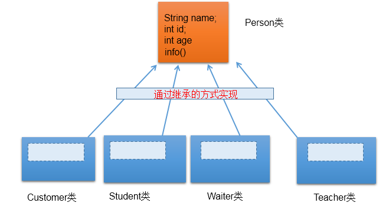
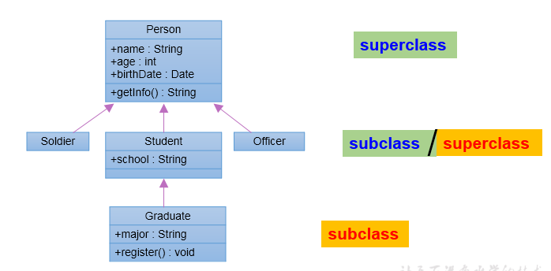

# 面向对象的特征二：继承性

## 为什么要有类的继承性？(继承性的好处）

1. 减少了代码的冗余，提高了代码的复用性
2. 便于功能的扩展
3. 为之后多态性的使用，提供了前提
   

## 继承性的格式

```java
// A:子类、派生类、subclass
// B:父类、超类、基类、superclass
class A extends B {
}
```

## 子类继承父类以后有哪些不同？

1. 体现：一旦子类A继承父类B以后，子类A中就获取了父类B中声明的所有的属性和方法。

   **特别的，父类中声明为private的属性或方法，子类继承父类以后，仍然认为获取了父类中私的结构。只因为封装性的影响，使得子类不能直接调用父类的结构而已。**

2. 子类继承父类以后，还可以声明自己特有的属性或方法：实现功能的拓展。 子类和父类的关系，不同于子集和集合的关系。

## Java中继承性的说明

1. 一个类可以被多个子类继承。
2. Java中类的单继承性：一个类只能有一个父类
3. 子父类是相对的概念。
4. 子类直接继承的父类，称为：直接父类。间接继承的父类称为：间接父类
5. 子类继承父类以后，就获取了直接父类以及所间接父类中声明的属性和方法
   

## java.lang.Object类的理解

1. 如果我们没显式的声明一个类的父类的话，则此类继承于`java.lang.Object`类
2. 所的java类（除`java.lang.Object`类之外都直接或间接的继承于`java.lang.Object`类
3. 意味着，所的java类具有`java.lang.Object`类声明的功能。


