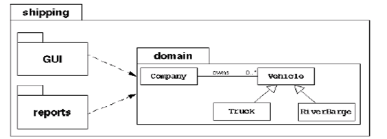
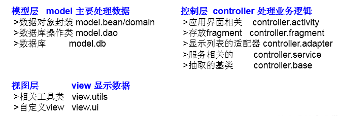
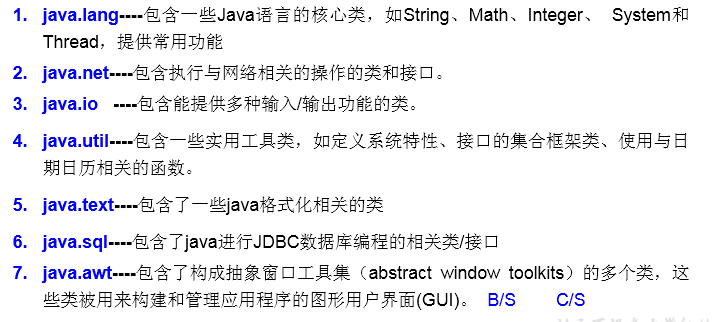

# 关键字：package/import

## package的使用

### 使用说明

1. 为了更好的实现项目中类的管理，提供包的概念
2. 使用`package`声明类或接口所属的包，声明在源文件的首行
3. 包，属于标识符，遵循标识符的命名规则、规范(xxxyyyzzz)、“见名知意”
4. 每"."一次，就代表一层文件目录。

### 举例

- 某航运软件系统包括：一组域对象、GUI和reports子系统
  
- MVC设计模式
  

### JDK中的主要包介绍

## import的使用

1. 在源文件中显式的使用`import`结构导入指定包下的类、接口
2. 声明在包的声明和类的声明之间
3. 如果需要导入多个结构，则并列写出即可
4. 可以使用"xxx.*"的方式，表示可以导入xxx包下的所结构
5. 如果使用的类或接口是`java.lang`包下定义的，则可以省略`import`结构
6. 如果使用的类或接口是本包下定义的，则可以省略`import`结构
7. 如果在源文件中，使用了不同包下的同名的类，则必须至少一个类需要以全类名的方式显示。
8. 使用"xxx.*"方式表明可以调用xxx包下的所结构。但是如果使用的是xxx子包下的结构，则仍需要显式导入
9. `import static`:导入指定类或接口中的静态结构:属性或方法。 

