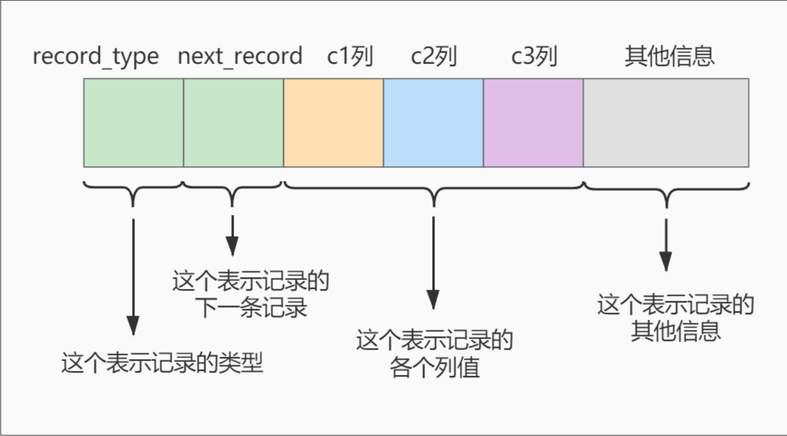
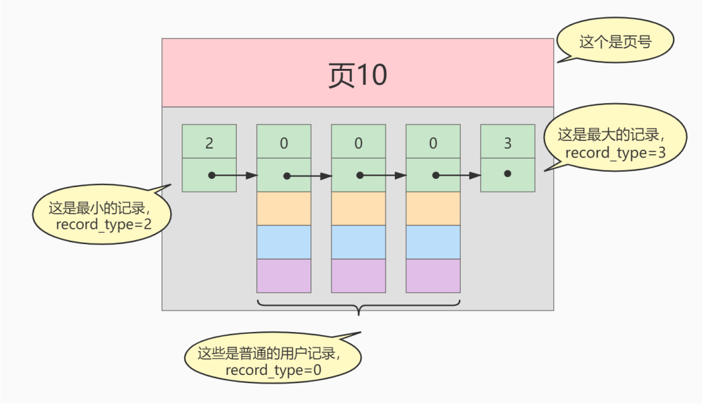
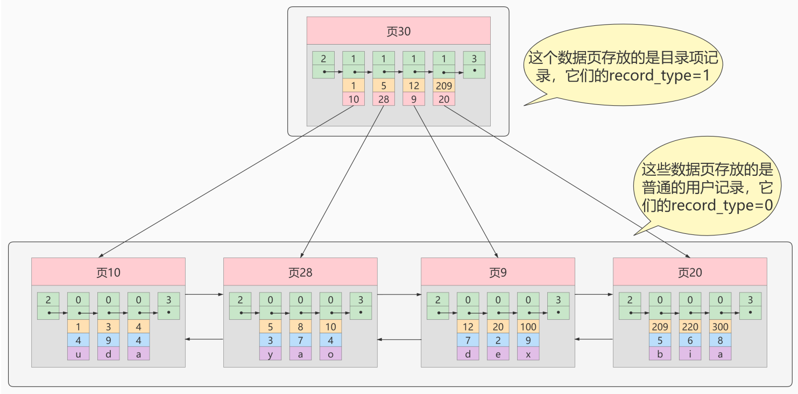
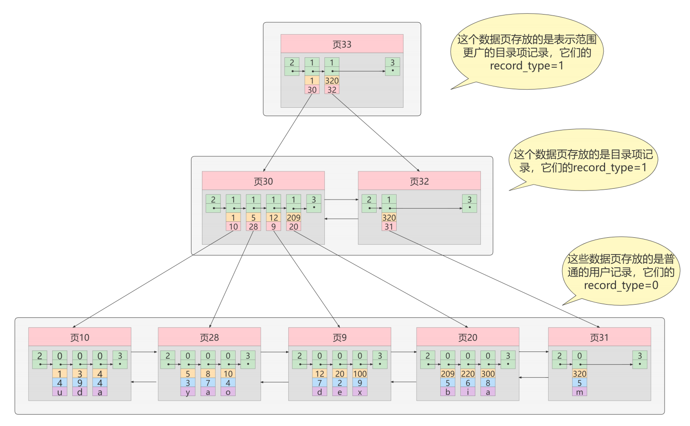
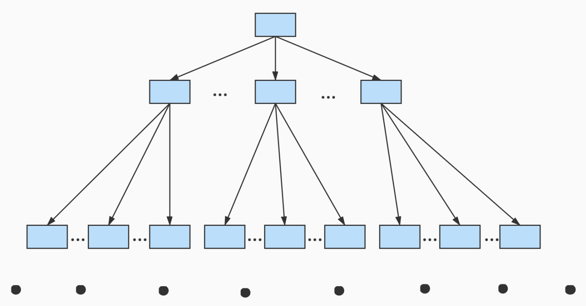
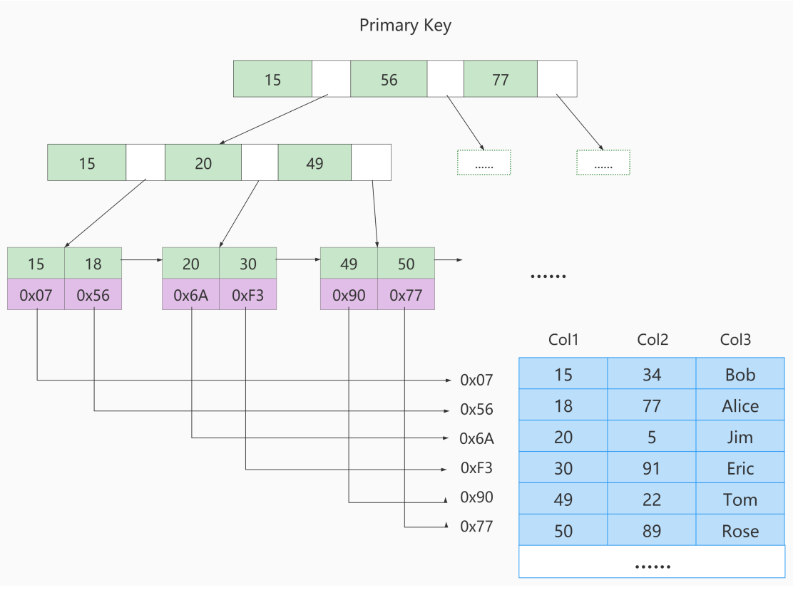
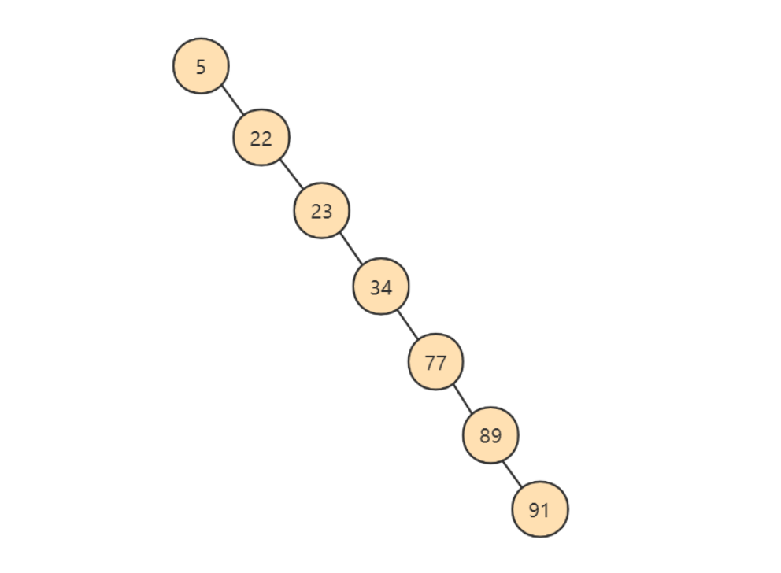
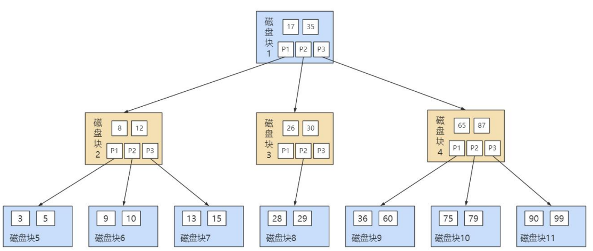
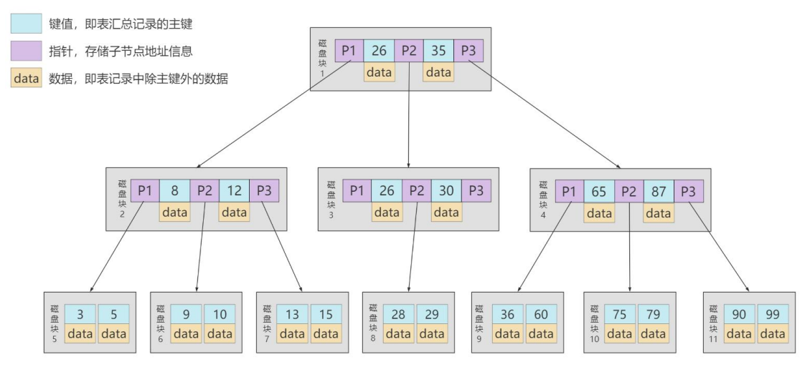

# 第06章_索引的数据结构

## **1.** **索引及其优缺点**

### **1.1** **索引概述**

MySQL官方对索引的定义为：**索引（Index）是帮助MySQL高效获取数据的数据结构**。

**索引的本质**：索引是数据结构。你可以简单理解为"排好序的快速查找数据结构"，满足特定查找算法。这些数据结构以某种方式指向数据，
这样就可以在这些数据结构的基础上实现`高级查找算法`。

### **1.2** **优点**

（1）类似大学图书馆建书目索引，提高数据检索的效率，降低`数据库的IO成本`，这也是创建索引最主要的原因。

（2）通过创建唯一索引，可以保证数据库表中每一行`数据的唯一性`。

（3）在实现数据的参考完整性方面，可以`加速表和表之间的连接`。换句话说，对于有依赖关系的子表和父表联合查询时，可以提高查询速度。

（4）在使用分组和排序子句进行数据查询时，可以显著`减少查询中分组和排序的时间`，降低了CPU的消耗。

### **1.3** **缺点**

（1）创建索引和维护索引要`耗费时间`，并且随着数据量的增加，所耗费的时间也会增加。

（2）索引需要占`磁盘空间`，除了数据表占数据空间之外，每一个索引还要占一定的物理空间`存储在磁盘上`
，如果有大量的索引，索引文件就可能比数据文件更快达到最大文件尺寸。

（3）虽然索引大大提高了查询速度，同时却会`降低更新表的速度`。当对表中的数据进行增加、删除和修改的时候，索引也要动态地维护，这样就降低了数据的维护速度。

## **2. InnoDB中索引的推演**

### **2.1** **索引之前的查找**

```sql
SELECT [列名列表] FROM 表名 WHERE 列名 = xxx;
```

**1.在一个页中的查找**

假设目前表中的记录比较少，所有的记录都可以被存放在一个页中，在查找记录的时候可以根据搜索条件的不同分为两种情况：

- 以主键为搜索条件
	- 可以在页目录中使用`二分法`快速定位到对应的槽，然后再遍历该槽对应分组中的记录即可快速找到指定的记录。
- 以其他列作为搜索条件
	- 因为在数据页中并没有对非主键建立所谓的页目录，所以我们无法通过二分法快速定位相应的槽。这种情况下只能从最小记录开始依次遍历单链表中的每条记录，然后对比每条记录是不是符合搜索条件。很显然，这种查找的效率是非常低的。

**2.在很多页中查找**

大部分情况下我们表中存放的记录都是非常多的，需要好多的数据页来存储这些记录。在很多页中查找记录的话可以分为两个步骤：

1. 定位到记录所在的页。
2. 从所在的页内查找相应的记录。

在没有索引的情况下，不论是根据主键列或者其他列的值进行查找，由于我们并不能快速的定位到记录所在的页，所以只能`从第一个页`
沿着`双向链表`
一直往下找，在每一个页中根据我们上面的查找方式去查找指定的记录。因为要遍历所有的数据页，所以这种方式显然是`超级耗时`的。

### **2.2** **设计索引**

```sql
mysql> CREATE TABLE index_demo(
    -> c1 INT,
    -> c2 INT,
    -> c3 CHAR(1),
    -> PRIMARY KEY(c1)
    -> ) ROW_FORMAT = Compact;
```

这个新建的`index_demo`表中有2个INT类型的列，1个CHAR(1)类型的列，而且我们规定了c1列为主键，这个表使用`Compact`
行格式来实际存储记录的。这里我们简化了index_demo表的行格式示意图：



- `record_type`：记录头信息的一项属性，表示记录的类型，`0`表示普通记录、`1`表示目录项记录、`2`表示最小记录、`3`表示最大记录。
- `next_record`：记录头信息的一项属性，表示下一条地址相对于本条记录的地址偏移量，我们用箭头来表明下一条记录是谁。
- `各个列的值`：这里只记录在`index_demo`表中的三个列，分别是`c1`、`c2`和`c3`。
- `其他信息`：除了上述3种信息以外的所有信息，包括其他隐藏列的值以及记录的额外信息。

将记录格式示意图的其他信息项暂时去掉并把它竖起来的效果就是这样：


把一些记录放到页里的示意图就是：



**1.** **一个简单的索引设计方案**

我们在根据某个搜索条件查找一些记录时为什么要遍历所有的数据页呢？因为各个页中的记录并没有规律，我们并不知道我们的搜索条件匹配哪些页中的记录，所以不得不依次遍历所有的数据页。所以如果我们`想快速的定位到需要查找的记录在哪些数据页`
中该咋办？我们可以为快速定位记录所在的数据页而`建立一个目录`，建这个目录必须完成下边这些事：

- **下一个数据页中用户记录的主键值必须大于上一个页中用户记录的主键值。**
- **给所有的页建立一个目录项。**


以`页28`为例，它对应`目录项2`，这个目录项中包含着该页的页号`28`以及该页中用户记录的最小主键值`5`
。我们只需要把几个目录项在物理存储器上连续存储（比如：数组），就可以实现根据主键值快速查找某条记录的功能了。比如：查找主键值为`20`
的记录，具体查找过程分两步：

1. 先从目录项中根据`二分法`快速确定出主键值为`20`的记录在`目录项3`中（因为 12 < 20 < 209 ），它对应的页是`页9`。

2. 再根据前边说的在页中查找记录的方式去`页9`中定位具体的记录。

至此，针对数据页做的简易目录就搞定了。这个目录有一个别名，称为`索引`。

**2. InnoDB中的索引方案**

**① 迭代1次：目录项纪录的页**

我们把前边使用到的目录项放到数据页中的样子就是这样：



从图中可以看出来，我们新分配了一个编号为30的页来专门存储目录项记录。这里再次强调`目录项记录`和普通的`用户记录`的**不同点
**：

- `目录项记录`的`record_type`值是1，而`普通用户记录`的`record_type`值是0。
- 目录项记录只有`主键值和页的编号`两个列，而普通的用户记录的列是用户自己定义的，可能包含`很多列`，另外还有InnoDB自己添加的隐藏列。
- 了解：记录头信息里还有一个叫`min_rec_mask`的属性，只有在存储`目录项记录`的页中的主键值最小的`目录项记录`的`min_rec_mask`
  值为`1`，其他别的记录的`min_rec_mask`值都是`0`。

**相同点：**两者用的是一样的数据页，都会为主键值生成`Page Directory`（页目录），从而在按照主键值进行查找时可以使用`二分法`
来加快查询速度。

现在以查找主键为`20`的记录为例，根据某个主键值去查找记录的步骤就可以大致拆分成下边两步：

1. 先到存储`目录项记录`的页，也就是页30中通过`二分法`快速定位到对应目录项，因为 12 < 20 < 209 ，所以定位到对应的记录所在的页就是页9。

2. 再到存储用户记录的页9中根据`二分法`快速定位到主键值为`20`的用户记录。

**② 迭代2次：多个目录项纪录的页**


从图中可以看出，我们插入了一条主键值为320的用户记录之后需要两个新的数据页：

- 为存储该用户记录而新生成了`页31`。
- 因为原先存储目录项记录的`页30的容量已满`（我们前边假设只能存储4条目录项记录），所以不得不需要一个新的`页32`来存放`页31`
  对应的目录项。

现在因为存储目录项记录的页不止一个，所以如果我们想根据主键值查找一条用户记录大致需要3个步骤，以查找主键值为`20`的记录为例：

1. 确定`目录项记录页`我们现在的存储目录项记录的页有两个，即`页30`和`页32`，又因为页30表示的目录项的主键值的范围是 [1, 320)
   ，页32表示的目录项的主键值不小于 320 ，所以主键值为`20`的记录对应的目录项记录在`页30`中。

2. 通过目录项记录页`确定用户记录真实所在的页`。在一个存储`目录项记录`的页中通过主键值定位一条目录项记录的方式说过了。

3. 在真实存储用户记录的页中定位到具体的记录。

**③ 迭代3次：目录项记录页的目录页**



如图，我们生成了一个存储更高级目录项的`页33`，这个页中的两条记录分别代表页30和页32，如果用户记录的主键值在`[1, 320)`
之间，则到页30中查找更详细的目录项记录，如果主键值`不小于320`的话，就到页32中查找更详细的目录项记录。

我们可以用下边这个图来描述它：



这个数据结构，它的名称是`B+树`。

**④** **B+Tree**

一个B+树的节点其实可以分成好多层，规定最下边的那层，也就是存放我们用户记录的那层为第`0`
层，之后依次往上加。之前我们做了一个非常极端的假设：存放用户记录的页`最多存放3条记录`，存放目录项记录的页`最多存放4条记录`
。其实真实环境中一个页存放的记录数量是非常大的，假设所有存放用户记录的叶子节点代表的数据页可以存放`100条用户记录`
，所有存放目录项记录的内节点代表的数据页可以存放`1000条目录项记录`，那么：

- 如果B+树只有1层，也就是只有1个用于存放用户记录的节点，最多能存放`100`条记录。
- 如果B+树有2层，最多能存放`1000×100=10,0000`条记录。
- 如果B+树有3层，最多能存放`1000×1000×100=1,0000,0000`条记录。
- 如果B+树有4层，最多能存放`1000×1000×1000×100=1000,0000,0000`条记录。相当多的记录！！！

你的表里能存放`100000000000`条记录吗？所以一般情况下，我们`用到的B+树都不会超过4层`
，那我们通过主键值去查找某条记录最多只需要做4个页面内的查找（查找3个目录项页和一个用户记录页），又因为在每个页面内有所谓的`Page Directory`
（页目录），所以在页面内也可以通过`二分法`实现快速定位记录。

### **2.3** **常见索引概念**

**1.** **聚簇索引**

**特点：**

1. 使用记录主键值的大小进行记录和页的排序，这包括三个方面的含义：
	
	- `页内`的记录是按照主键的大小顺序排成一个`单向链表`。
	
	- 各个存放`用户记录的页`也是根据页中用户记录的主键大小顺序排成一个`双向链表`。
	- 存放`目录项记录的页`分为不同的层次，在同一层次中的页也是根据页中目录项记录的主键大小顺序排成一个`双向链表`。

2. B+树的`叶子节点`存储的是完整的用户记录。

   所谓完整的用户记录，就是指这个记录中存储了所有列的值（包括隐藏列）。

**优点：**

- `数据访问更快`，因为聚簇索引将索引和数据保存在同一个B+树中，因此从聚簇索引中获取数据比非聚簇索引更快
- 聚簇索引对于主键的`排序查找`和`范围查找`速度非常快
-
按照聚簇索引排列顺序，查询显示一定范围数据的时候，由于数据都是紧密相连，数据库不用从多个数据块中提取数据，所以`节省了大量的io操作`。

**缺点：**

- `插入速度严重依赖于插入顺序`，按照主键的顺序插入是最快的方式，否则将会出现页分裂，严重影响性能。因此，对于InnoDB表，我们一般都会定义一个
  **自增ID列为主键**
- `更新主键的代价很高`，因为将会导致被更新的行移动。因此，对于InnoDB表，我们一般定义**主键为不可更新**
- `二级索引访问需要两次索引查找`，第一次找到主键值，第二次根据主键值找到行数据

**2.** **二级索引（辅助索引、非聚簇索引）**


**概念：回表**
我们根据这个以c2列大小排序的B+树只能确定我们要查找记录的主键值，所以如果我们想根据c2列的值查找到完整的用户记录的话，仍然需要到`聚簇索引`
中再查一遍，这个过程称为`回表`。也就是根据c2列的值查询一条完整的用户记录需要使用到`2`棵B+树！

**3.** **联合索引**

我们也可以同时以多个列的大小作为排序规则，也就是同时为多个列建立索引，比方说我们想让B+树按照`c2和c3列`的大小进行排序，这个包含两层含义：

- 先把各个记录和页按照c2列进行排序。

- 在记录的c2列相同的情况下，采用c3列进行排序

注意一点，以c2和c3列的大小为排序规则建立的B+树称为`联合索引`，本质上也是一个二级索引。它的意思与分别为c2和c3列分别建立索引的表述是不同的，不同点如下：

- 建立`联合索引`只会建立如上图一样的1棵B+树。

- 为c2和c3列分别建立索引会分别以c2和c3列的大小为排序规则建立2棵B+树。

### **2.4 InnoDB的B+树索引的注意事项**

**1.** **根页面位置万年不动**

我们前边介绍B+索引的时候，为了大家理解上的方便，先把存储用户记录的叶子节点都画出来，然后接着画存储目录项记录的内节点，实际上B+树的形成过程是这样的：

- 每当为某个表创建一个B+树索引（聚簇索引不是人为创建的，默认就有）的时候，都会为这个索引创建一个`根节点`
  页面。最开始表中没有数据的时候，每个B+树索引对应的`根节点`中既没有用户记录，也没有目录项记录。
- 随后向表中插入用户记录时，先把用户记录存储到这个`根节点`中。
- 当根节点中的可用`空间用完时`继续插入记录，此时会将根节点中的所有记录复制到一个新分配的页，比如`页a`
  中，然后对这个新页进行`页分裂`的操作，得到另一个新页，比如`页b`
  。这时新插入的记录根据键值（也就是聚簇索引中的主键值，二级索引中对应的索引列的值）的大小就会被分配到`页a`或者`页b`
  中，而`根节点`便升级为存储目录项记录的页。

这个过程特别注意的是：一个B+树索引的根节点自诞生之日起，便不会再移动。这样只要我们对某个表建立一个索引，那么它的根节点的页号便会被记录到某个地方，然后凡是`InnoDB`
存储引擎需要用到这个索引的时候，都会从那个固定的地方取出根节点的页号，从而来访问这个索引。

**2.** **内节点中目录项记录的唯一性**

**3.** **一个页面最少可以存储2条记录**

一个B+树只需要很少的层级就可以轻松存储数亿条记录，查询速度相当不错！这是因为B+树本质上就是一个大的多层级目录，每经过一个目录时都会过滤掉许多无效的子目录，直到最后访问的存储真实数据的目录。那如果一个大的目录中只存放一个子目录是个啥效果呢？那就是目录层级非常非常非常多，而且最后的那个存放真实数据的目录中存放一条记录。费了半天劲只能存放一条真实的用户记录？所以`InnoDB的一个数据页至少可以存放两条记录`

## **3. MyISAM中的索引方案**

**B树索引适用存储引擎如表所示：**

| 索引/存储引擎  | MyISAM | InnoDB | Memory |
|----------|--------|--------|--------|
| B-Tree索引 | 支持     | 支持     | 支持     |

即使多个存储引擎支持同一种类型的索引，但是他们的实现原理也是不同的。Innodb和MyISAM默认的索引是Btree索引；而Memory默认的索引是Hash索引。

MyISAM引擎使用`B+Tree`作为索引结构，叶子节点的data域存放的是`数据记录的地址`。

### **3.1 MyISAM索引的原理**



### **3.2 MyISAM** **与** **InnoDB对比**

**MyISAM的索引方式都是"非聚簇"的，与InnoDB包含1个聚簇索引是不同的。**

**小结两种引擎中索引的区别：**

① 在InnoDB存储引擎中，我们只需要根据主键值对`聚簇索引`进行一次查找就能找到对应的记录，而在`MyISAM`中却需要进行一次`回表`
操作，意味着MyISAM中建立的索引相当于全部都是`二级索引`。

② InnoDB的数据文件本身就是索引文件，而MyISAM索引文件和数据文件是`分离的`，索引文件仅保存数据记录的地址。

③ InnoDB的非聚簇索引data域存储相应记录`主键的值`，而MyISAM索引记录的是`地址`。换句话说，InnoDB的所有非聚簇索引都引用主键作为data域。

④ MyISAM的回表操作是十分`快速`的，因为是拿着地址偏移量直接到文件中取数据的，反观InnoDB是通过获取主键之后再去聚簇索引里找记录，虽然说也不慢，但还是比不上直接用地址去访问。

⑤ InnoDB要求表`必须有主键`（`MyISAM可以没有`
）。如果没有显式指定，则MySQL系统会自动选择一个可以非空且唯一标识数据记录的列作为主键。如果不存在这种列，则MySQL自动为InnoDB表生成一个隐含字段作为主键，这个字段长度为6个字节，类型为长整型。

## **4.** **索引的代价**

索引是个好东西，可不能乱建，它在空间和时间上都会有消耗：

- **空间上的代价**

每建立一个索引都要为它建立一棵B+树，每一棵B+树的每一个节点都是一个数据页，一个页默认会占用`16KB`
的存储空间，一棵很大的B+树由许多数据页组成，那就是很大的一片存储空间。

- **时间上的代价**

每次对表中的数据进行`增、删、改`
操作时，都需要去修改各个B+树索引。而且我们讲过，B+树每层节点都是按照索引列的值`从小到大的顺序排序`而组成了`双向链表`
。不论是叶子节点中的记录，还是内节点中的记录（也就是不论是用户记录还是目录项记录）都是按照索引列的值从小到大的顺序而形成了一个单向链表。而增、删、改操作可能会对节点和记录的排序造成破坏，所以存储引擎需要额外的时间进行一些`记录移位`，`页面分裂`、`页面回收`
等操作来维护好节点和记录的排序。如果我们建了许多索引，每个索引对应的B+树都要进行相关的维护操作，会给性能拖后腿。

## **5. MySQL数据结构选择的合理性**

### **5.1** **二叉搜索树**

如果我们利用二叉树作为索引结构，那么磁盘的IO次数和索引树的高度是相关的。



为了提高查询效率，就需要`减少磁盘IO数`。为了减少磁盘IO的次数，就需要尽量`降低树的高度`，需要把原来"瘦高"的树结构变的"矮胖"
，树的每层的分叉越多越好。

### **5.2 AVL树**


针对同样的数据，如果我们把二叉树改成`M 叉树`（M>2）呢？当 M=3 时，同样的 31 个节点可以由下面的三叉树来进行存储：


### **5.3 B-Tree**

B 树的结构如下图所示：



一个 M 阶的 B 树（M>2）有以下的特性：

1. 根节点的儿子数的范围是 [2,M]。

2. 每个中间节点包含 k-1 个关键字和 k 个孩子，孩子的数量 = 关键字的数量 +1，k 的取值范围为[ceil(M/2), M]。

3. 叶子节点包括 k-1 个关键字（叶子节点没有孩子），k 的取值范围为 [ceil(M/2), M]。

4. 假设中间节点节点的关键字为：Key[1], Key[2], …, Key[k-1]，且关键字按照升序排序，即 Key[i] <Key[i+1]。此时 k-1 个关键字相当于划分了
   k 个范围，也就是对应着 k 个指针，即为：P[1], P[2], …,P[k]，其中 P[1] 指向关键字小于 Key[1] 的子树，P[i] 指向关键字属于 (
   Key[i-1], Key[i]) 的子树，P[k]指向关键字大于 Key[k-1] 的子树。

5. 所有叶子节点位于同一层。

上面那张图所表示的 B 树就是一棵 3 阶的 B 树。我们可以看下磁盘块 2，里面的关键字为（8，12），它有 3 个孩子 (3，5)，(9，10) 和 (
13，15)，你能看到 (3，5) 小于 8，(9，10) 在 8 和 12 之间，而 (13，15)大于 12，刚好符合刚才我们给出的特征。

然后我们来看下如何用 B 树进行查找。假设我们想要`查找的关键字是 9`，那么步骤可以分为以下几步：

1. 我们与根节点的关键字 (17，35）进行比较，9 小于 17 那么得到指针 P1；

2. 按照指针 P1 找到磁盘块 2，关键字为（8，12），因为 9 在 8 和 12 之间，所以我们得到指针 P2；

3. 按照指针 P2 找到磁盘块 6，关键字为（9，10），然后我们找到了关键字 9。

你能看出来在 B 树的搜索过程中，我们比较的次数并不少，但如果把数据读取出来然后在内存中进行比较，这个时间就是可以忽略不计的。而读取磁盘块本身需要进行
I/O
操作，消耗的时间比在内存中进行比较所需要的时间要多，是数据查找用时的重要因素。`B 树相比于平衡二叉树来说磁盘 I/O 操作要少`
，在数据查询中比平衡二叉树效率要高。所以`只要树的高度足够低，IO次数足够少，就可以提高查询性能`。

**再举例1：**



### **5.4 B+Tree**

**B+** **树和** **B** **树的差异：**

1. 有 k 个孩子的节点就有 k 个关键字。也就是孩子数量 = 关键字数，而 B 树中，孩子数量 = 关键字数+1。

2. 非叶子节点的关键字也会同时存在在子节点中，并且是在子节点中所有关键字的最大（或最小）。

3. 非叶子节点仅用于索引，不保存数据记录，跟记录有关的信息都放在叶子节点中。而 B
   树中， `非叶子节点既保存索引，也保存数据记录`。

4. 所有关键字都在叶子节点出现，叶子节点构成一个有序链表，而且叶子节点本身按照关键字的大小从小到大顺序链接。

> B 树和 B+ 树都可以作为索引的数据结构，在 MySQL 中采用的是 B+ 树。
>
> 但B树和B+树各有自己的应用场景，不能说B+树完全比B树好，反之亦然。

**思考题：为了减少IO，索引树会一次性加载吗？**

> 1、数据库索引是存储在磁盘上的，如果数据量很大，必然导致索引的大小也会很大，超过几个G。
>
> 2、当我们利用索引查询时候，是不可能将全部几个G的索引都加载进内存的，我们能做的只能是：逐一加载每一个磁盘页，因为磁盘页对应着索引树的节点。

**思考题：B+树的存储能力如何？为何说一般查找行记录，最多只需1~3次磁盘IO**

> InnoDB存储引擎中页的大小为16KB，一般表的主键类型为INT(占用4个字节)或BIGINT(占用8个字节)
> ，指针类型也一般为4或8个字节，也就是说一个页（B+Tree中的一个节点）中大概存储16KB/(8B+8B)
> =1K个键值，因为是估算，为了方便计算，这里的K取值为10^3。也就是说一个深度为3的B+Tree索引可以维护10^3 * 10^3 * 10^3 =
> 10亿条记录。（这里假定一个数据页也存储10^3条行记录数据了）
>
> 实际情况中每个节点可能不能填充满，因此在数据库中，`B+Tree的高度一般都在2~4层`
> 。MySQL的InnoDB存储引擎在设计时是将根节点常驻内存的，也就是说查找某一键值的行记录时最多只需要1~3次磁盘I/O操作

**思考题：为什么说B+树比B-树更适合实际应用中操作系统的文件索引和数据库索引？**

> 1.B+树的磁盘读写代价更低
>
>
B+树的内部结点并没有指向关键字具体信息的指针。因此其内部结点相对于B树更小。如果把所有同一内部结点的关键字存放在同一盘块中，那么盘块所能容纳的关键字数量也越多。一次性读入内存中的需要查找的关键字也就越多。相对来说IO读写次数也就降低了。
>
> 2、B+树的查询效率更加稳定
>
> 由于非终结点并不是最终指向文件内容的节点，而只是叶子结点中关键字的索引。所有任何关键字的查找必须走一条从根结点到叶子结点的路。所有关键字查询的路径长度相同，导致每一个数据的查询效率相当。

**思考题：Hash索引与B+树索引的区别**

> 1、Hash索引`不能进行范围查询`，而B+树可以。这是因为Hash索引指向的数据是无序的，而B+树的叶子节点是个有序的链表。
>
> 2、Hash索引`不支持联合索引的最左侧原则`
>
（即联合索引的部分索引无法使用），而B+树可以。对于联合索引来说，Hash索引在计算Hash值的时候是将索引键合并后再一起计算Hash值，所以不会针对每个索引单独计算Hash值。因此如果用到联合索引的一个或者几个索引时，联合索引无法被利用。
>
> 3、Hash索引`不支持 ORDER BY 排序`，因为Hash索引指向的数据是无序的，因此无法起到排序优化的作用，而B+树索引数据是有序的，可以起到对该字段ORDER
> BY 排序优化的作用。同理，我们也无法用Hash索引进行`模糊查询`，而B+树使用LIKE进行模糊查询的时候，LIKE后面后模糊查询（比如%结尾）的话就可以起到优化作用。
>
> 4、`InnoDB不支持哈希索引`
