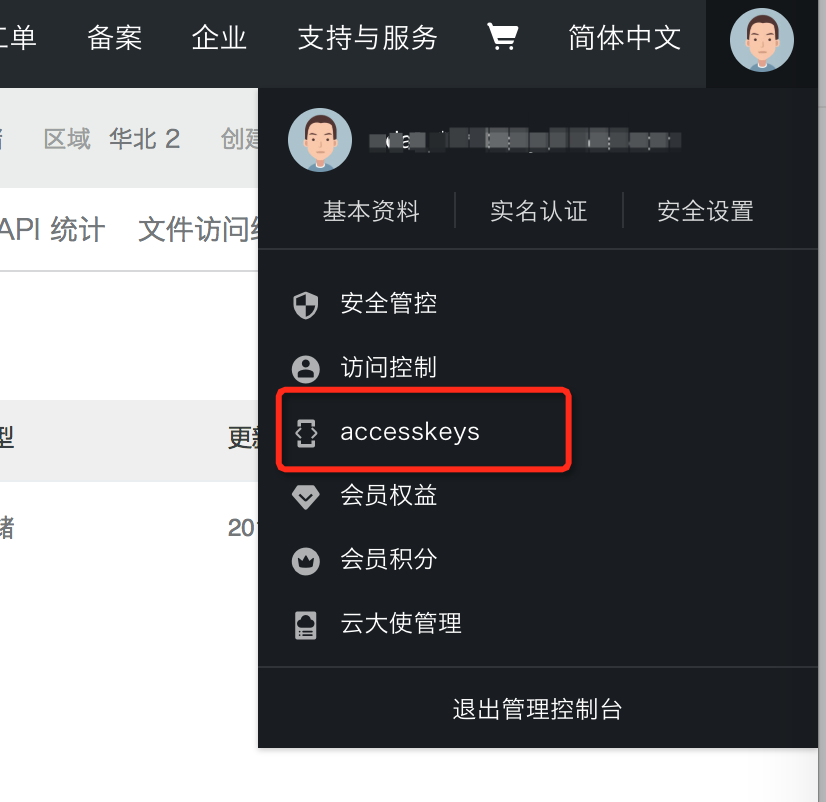

# 阿里云对象存储OSS最佳实践

本文主要介绍如何基于Post
Policy的使用规则在服务端通过各种语言代码完成签名，然后通过表单直传数据到OSS。由于服务端签名直传无需将AccessKey暴露在前端页面，相比JavaScript客户端签名直传具有更高的安全性。

## 流程和源码解析


1. 用户向应用服务器请求上传Policy和回调。 将客户端源码中的upload.js文件的以下代码片段的变量serverUrl的值设置为应用服务器的URL。
    ```
    // serverUrl是用户获取签名和Policy等信息的应用服务器的URL，请将下面的IP和Port配置为您自己的真实信息。
    serverUrl = 'http://88.88.XX.XX:8888'
    ```

   设置完成后，客户端会向该serverUrl发送Get请求来获取需要的信息。

	本场景为服务端签名后直传，不涉及上传回调。因此，您需要注释客户端源码中的upload.js文件内的'callback' :!q@#
	callbackbody字段，以关闭上传回调功能。
	
	```json
	{
	  "key": key + "${filename}",
	  "policy": policyBase64,
	  "OSSAccessKeyId": accessid,
	  // 设置服务端返回200状态码，默认返回204。
	  "success_action_status": "200",
	  "callback": callbackbody,
	  "signature": signature
	}
	```

2. 应用服务器返回上传Policy和签名给用户。

   应用服务器侧的签名直传服务会处理客户端发送的Get请求消息，您可以设置对应的代码让应用服务器能够给客户端返回正确的消息。

   以下是签名直传服务返回给客户端消息Body内容的示例：

   ```json
    {
    "accessid":"LTAI5tBDFVar1hoq****",
    "host":"http://post-test.oss-cn-hangzhou.aliyuncs.com",
    "policy":"eyJleHBpcmF0aW9uIjoiMjAxNS0xMS0wNVQyMDoyMzoyM1oiLCJjxb25kaXRpb25zIjpbWyJjcb250ZW50LWxlbmd0aC1yYW5nZSIsMCwxMDQ4NTc2MDAwXSxbInN0YXJ0cy13aXRoIiwiJGtleSIsInVzZXItZGlyXC8i****",
    "signature":"VsxOcOudx******z93CLaXPz+4s=",
    "expire":1446727949,
    "dir":"user-dirs/"
    }
   ```

   **Body中的各字段说明**

   | 字段        | 描述                                                                                                                                                                       |
   -----------|--------------------------------------------------------------------------------------------------------------------------------------------------------------------------|
   | accessid  | 用户请求的AccessKey ID                                                                                                                                                        |
   | host      | 用户发送上传请求的域名                                                                                                                                                              |
   | policy    | 用户表单上传的策略（Policy），Policy为经过Base64编码过的字符串。详情请参见[Post Policy](https://help.aliyun.com/document_detail/31988.htm?spm=a2c4g.11186623.0.0.160743b0wKePxr#section-d5z-1ww-wdb) |
   | signature | 对Policy签名后的字符串。详情请参见[Post Signature](https://help.aliyun.com/document_detail/31988.htm?spm=a2c4g.11186623.0.0.160743b0wKePxr#section-wny-mww-wdb)                        |
   | expire    | 由服务器端指定的Policy过期时间，格式为Unix时间戳（自UTC时间1970年01月01号开始的秒数）                                                                                                                    |
   | dir       | 限制上传的文件前缀                                                                                                                                                                |

3. 用户使用Post方法向OSS发送文件上传请求
   :::info 说明
	- 除file表单域外，包含key在内的其他所有表单域的大小均不能超过8 KB
	-
   客户端上传默认同名覆盖，如果您不希望覆盖同名文件，可以在上传请求的header中携带参数x-oss-forbid-overwrite，并指定其值为true。当您上传的文件在OSS中存在同名文件时，该文件会上传失败，并返回FileAlreadyExists错误
   :::
   ```js
   new_multipart_params = {
     // key表示上传到Bucket内的Object的完整路径，例如exampledir/exampleobject.txtObject，完整路径中不能包含Bucket名称。
     // filename表示待上传的本地文件名称。
     'key' : key + '${filename}',
     'policy': policyBase64,
     'OSSAccessKeyId': accessid,
     // 设置服务端返回状态码为200，不设置则默认返回状态码204。
     'success_action_status' : '200',    
     'signature': signature,
	};	
   ```

## Java代码示例

[官方示例](https://help.aliyun.com/document_detail/91868.htm?spm=a2c4g.11186623.0.0.1607bfcbZWAaJf#concept-ahk-rfz-2fb)

## Aliyun Spring Boot OSS 示例

### 接入 OSS

在启动示例进行演示之前，我们先了解一下如何接入 OSS。

**注意：本节只是为了便于您理解接入方式，本示例代码中已经完成接入工作，您只需修改 accessKey、secretKey、endpoint 即可。**

1. 修改 pom.xml 文件，引入 aliyun-oss-spring-boot-starter。

   ```xml
   <dependency>
	   <groupId>com.alibaba.cloud</groupId>
	   <artifactId>aliyun-oss-spring-boot-starter</artifactId>
   </dependency>
   ```

2. 在配置文件中配置 OSS 服务对应的 accessKey、secretKey 和 endpoint。

   ```properties
   // application.properties
   alibaba.cloud.access-key=your-ak
   alibaba.cloud.secret-key=your-sk
   alibaba.cloud.oss.endpoint=***
   ```

   以阿里云 accessKey、secretKey 为例，获取方式如下。

   i. 在阿里云控制台界面，单击右上角头像，选择
   accesskeys，或者直接登录[用户信息管理界面](https://usercenter.console.aliyun.com/)：

   

   ii. 获取 accessKey、secretKey：

   

   **注意**：如果您使用了阿里云 [STS服务](https://help.aliyun.com/document_detail/28756.html) 进行短期访问权限管理，则除了
   accessKey、secretKey、endpoint 以外，还需配置 securityToken。

3. 注入 OSSClient 并进行文件上传下载等操作。

   ```java
	  @Service
	  public class YourService {
		  @Autowired
		  private OSSClient ossClient;

		  public void saveFile() {
			  // download file to local
			  ossClient.getObject(new GetObjectRequest(bucketName, objectName), new File("pathOfYourLocalFile"));
		  }
	  }
   ```
   **说明**：直接注入OSSClient 方式通常用于大量文件对象操作的场景。如果仅仅是需要读取文件对象内容，OSS Starter 也支持以
   Resource 方式读取文件，详情请参考[下文](#1)。

### 启动应用

1. 在应用的 /src/main/resources/application.properties 中添加基本配置信息和 OSS 配置。

   ```properties
   spring.application.name=oss-example
   server.port=18084
   alibaba.cloud.access-key=your-ak
   alibaba.cloud.secret-key=your-sk
   alibaba.cloud.oss.endpoint=***
	  ```

2. 通过 IDE 直接启动或者编译打包后启动应用。

	- IDE直接启动：找到主类 `OSSApplication`，执行 main 方法启动应用。
	- 打包编译后启动：
		1. 执行 `mvn clean package` 将工程编译打包；
		2. 执行 `java -jar oss-example.jar`启动应用。

应用启动后会自动在 OSS 上创建一个名为 `aliyun-spring-boot-test` 的 Bucket。

### 上传或下载文件

#### 上传文件

使用 curl 调用上传接口 upload。该接口会上传 classpath 下的的 oss-test.json 文件。文件内容是一段 json:

```json
curl http://localhost:18084/upload
```

显示结果：

```
// 如果配置正确，则输出
upload success
// 如果上传的过程中发生异常，则会输出 upload fail: fail reason。比如accessKeyId配置错误的时候，fail reason内容如下
upload fail: The OSS Access Key Id you provided does not exist in our records. [ErrorCode]: InvalidAccessKeyId [RequestId]: RequestId [HostId]: xxx.oss-cn-beijing.aliyuncs.com [ResponseError]: InvalidAccessKeyId The OSS Access Key Id you provided does not exist in our records. RequestId xxx.oss-cn-beijing.aliyuncs.com xxx-accessKeyId
```

#### 下载文件

使用 curl 调用下载接口 download。该接口会下载刚才用 upload 接口上传的 oss-test.json 文件，并打印文件内容到结果中:

```json
curl http://localhost:18084/download
```

显示结果：

```
// 如果配置正确，则输出
download success, content: { "name": "oss-test" }
// 下载的过程中如果发生异常，则会输出download fail: fail reason。比如accessKeyId配置错误，则fail reason内容如下
download fail: The OSS Access Key Id you provided does not exist in our records. [ErrorCode]: InvalidAccessKeyId [RequestId]: RequestId [HostId]: xxx.oss-cn-beijing.aliyuncs.com [ResponseError]: InvalidAccessKeyId The OSS Access Key Id you provided does not exist in our records. RequestId sxxx.oss-cn-beijing.aliyuncs.com xxx-accessKeyId
```

### 在 OSS 上验证结果

完成文件上传或者下载操作后，可以登录 OSS 控制台进行验证。

1. 登陆[OSS控制台](https://oss.console.aliyun.com/)，可以看到左侧 Bucket 列表新增一个名字为`aliyun-spring-boot-test`的
   Bucket。

   

2. 单击`aliyun-spring-boot-test` Bucket，选择 `文件管理` 页签，发现上传的 oss-test 文件。上传的 objectName
   为`oss-test.json`。目录和文件以'/'符号分割。

   

## 查看 Endpoint 信息

Spring Boot 应用支持通过 Endpoint 来暴露相关信息，OSS Starter 也支持这一点。

**前提条件**：

在 maven 中添加 `spring-boot-starter-actuator`依赖，并在配置中允许 Endpoints 的访问。

- Spring Boot1.x 中添加配置 `management.security.enabled=false`
- Spring Boot2.x 中添加配置 `management.endpoints.web.exposure.include=*`

Spring Boot1.x 可以通过访问 http://127.0.0.1:18084/oss 来查看 OSS Endpoint 的信息。

Spring Boot2.x 可以通过访问 http://127.0.0.1:18084/actuator/oss 来访问。

Endpoint 内部会显示所有的 OSSClient 配置信息，以及该 OSSClient 对应的 Bucket 列表。


### 以 Resource 的形式读取文件

OSS Starter 支持以 Resource 的形式得到文件对象。如果只需读取少量文件，您可以使用这种方式。

**使用方法**：

只需配置 OSS 协议对应的 Resource 即可：

```java
@Value("oss://aliyun-spring-boot/oss-test")
private Resource file;

// 文件内容的读取
StreamUtils.copyToString(file.getInputStream(), Charset.forName(CharEncoding.UTF_8))
```
