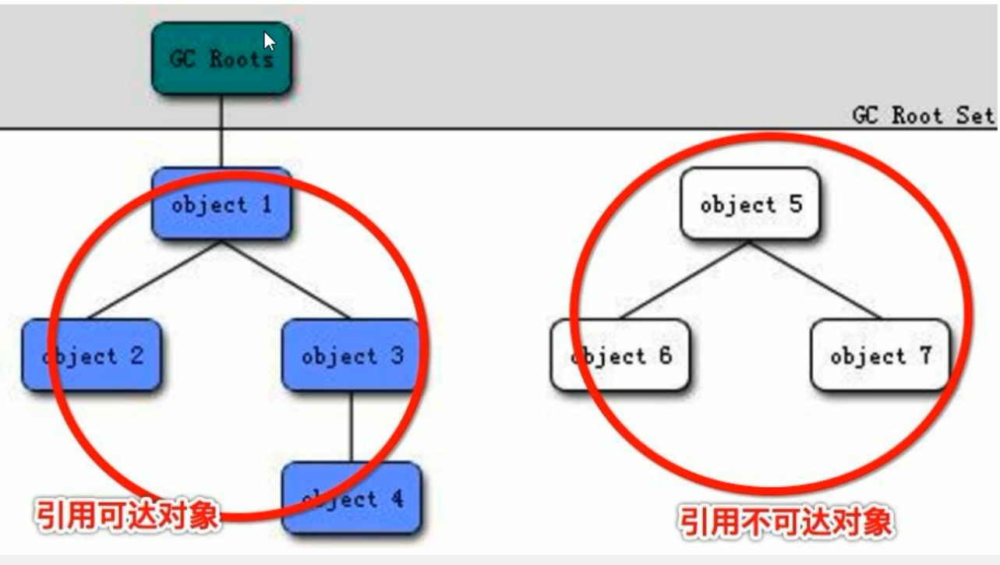

# GC Roots

## JVM垃圾回收的时候如何确定垃圾？是否知道什么是GC Roots

### 什么是垃圾

简单来说就是内存中已经不再被使用的空间就是垃圾

### 如何判断一个对象是否可以被回收

#### 引用计数法

Java中，引用和对象是有关联的。如果要操作对象则必须用引用进行。

因此，很显然一个简单的办法就是通过引用计数来判断一个对象是否可以回收。简单说，给对象中添加一个引用计数器

每当有一个地方引用它，计数器值加1

每当有一个引用失效，计数器值减1

任何时刻计数器值为零的对象就是不可能再被使用的，那么这个对象就是可回收对象。

那么为什么主流的Java虚拟机里面都没有选用这个方法呢？其中最主要的原因是它很难解决对象之间相互循环引用的问题。

该算法存在但目前无人用了，解决不了循环引用的问题，了解即可。


#### 枚举根节点做可达性分析

根搜索路径算法

为了解决引用计数法的循环引用个问题，Java使用了可达性分析的方法：


所谓 GC Roots 或者说 Tracing Roots的“根集合” 就是一组必须活跃的引用

基本思路就是通过一系列名为 GC Roots的对象作为起始点，从这个被称为GC Roots的对象开始向下搜索，如果一个对象到GC
Roots没有任何引用链相连，则说明此对象不可用。也即给定一个集合的引用作为根出发，通过引用关系遍历对象图，能被遍历到的（可到达的）对象就被判定为存活，没有被遍历到的对象就被判定为死亡



必须从GC Roots对象开始，这个类似于linux的 / 也就是根目录

蓝色部分是从GC Roots出发，能够循环可达

而白色部分，从GC Roots出发，无法到达

#### 一句话理解GC Roots

假设我们现在有三个实体，分别是 人，狗，毛衣

然后他们之间的关系是：人 牵着 狗，狗穿着毛衣，他们之间是强连接的关系

有一天人消失了，只剩下狗狗 和 毛衣，这个时候，把人想象成 GC Roots，因为 人 和 狗之间失去了绳子连接，

那么狗可能被回收，也就是被警察抓起来，被送到流浪狗寄养所

假设狗和人有强连接的时候，狗狗就不会被当成是流浪狗

#### 那些对象可以当做GC Roots

- 虚拟机栈（栈帧中的局部变量区，也叫做局部变量表）中的引用对象
- 方法区中的类静态属性引用的对象
- 方法区中常量引用的对象
- 本地方法栈中的JNI（Native方法）的引用对象

#### 代码说明

```java
public class GCRootDemo {
    // 方法区中的类静态属性引用的对象
    // private static GCRootDemo2 t2;

    // 方法区中的常量引用，GC Roots 也会以这个为起点，进行遍历
    // private static final GCRootDemo3 t3 = new GCRootDemo3(8);

    public static void m1() {
        // 第一种，虚拟机栈中的引用对象
        GCRootDemo t1 = new GCRootDemo();
        System.gc();
        System.out.println("第一次GC完成");
    }
    public static void main(String[] args) {
        m1();
    }
}
```

