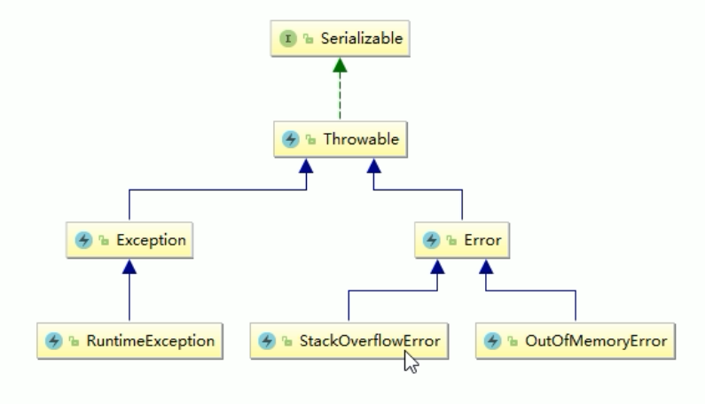

# Java内存溢出OOM

## 经典错误

JVM中常见的两个错误

StackOverflowError ：栈溢出

OutOfMemoryError: java heap space：堆溢出

除此之外，还有以下的错误

- java.lang.StackOverflowError
- java.lang.OutOfMemoryError：java heap space
- java.lang.OutOfMemoryError：GC overhead limit exceeded
- java.lang.OutOfMemoryError：Direct buffer memory
- java.lang.OutOfMemoryError：unable to create new native thread
- java.lang.OutOfMemoryError：Metaspace

## 架构

OutOfMemoryError和StackOverflowError是属于Error，不是Exception



## StackOverflowError

堆栈溢出，我们有最简单的一个递归调用，就会造成堆栈溢出，也就是深度的方法调用

栈一般是512K，不断的深度调用，直到栈被撑破

```java
public class StackOverflowErrorDemo {

    public static void main(String[] args) {
        stackOverflowError();
    }
    /**
     * 栈一般是512K，不断的深度调用，直到栈被撑破
     * Exception in thread "main" java.lang.StackOverflowError
     */
    private static void stackOverflowError() {
        stackOverflowError();
    }
}
```

运行结果

```java
Exception in thread "main" java.lang.StackOverflowError
	at HelloGC.stackOverflowError(HelloGC.java:66)
```

## OutOfMemoryError

### java heap space

创建了很多对象，导致堆空间不够存储

```java
public class JavaHeapSpaceDemo {
    public static void main(String[] args) {

        // 堆空间的大小 -Xms10m -Xmx10m
        // 创建一个 80M的字节数组
        byte [] bytes = new byte[80 * 1024 * 1024];
    }
}
```

我们创建一个80M的数组，会直接出现Java heap space

```
Exception in thread "main" java.lang.OutOfMemoryError: Java heap space
	at HelloGC.main(HelloGC.java:62)
```

### GC overhead limit exceeded

GC回收时间过长时会抛出OutOfMemoryError，过长的定义是，超过了98%的时间用来做GC，并且回收了不到2%的堆内存

连续多次GC都只回收了不到2%的极端情况下，才会抛出。假设不抛出GC overhead limit 错误会造成什么情况呢？

那就是GC清理的这点内存很快会再次被填满，迫使GC再次执行，这样就形成了恶性循环，CPU的使用率一直都是100%，而GC却没有任何成果。


代码演示：

为了更快的达到效果，我们首先需要设置JVM启动参数

```
-Xms10m -Xmx10m -XX:+PrintGCDetails -XX:MaxDirectMemorySize=5m
```

这个异常出现的步骤就是，我们不断的像list中插入String对象，直到启动GC回收

```java
public class GCOverheadLimitDemo {
    public static void main(String[] args) {
        int i = 0;
        List<String> list = new ArrayList<>();
        try {
            while(true) {
                list.add(String.valueOf(++i).intern());
            }
        } catch (Exception e) {
            System.out.println("***************i:" + i);
            e.printStackTrace();
            throw e;
        } finally {

        }

    }
}
```

运行结果

```
[Full GC (Ergonomics) [PSYoungGen: 2047K->2047K(2560K)] [ParOldGen: 7099K->7099K(7168K)] 9147K->9147K(9728K), [Metaspace: 3316K->3316K(1056768K)], 0.0379997 secs] [Times: user=0.31 sys=0.00, real=0.04 secs] 
[Full GC (Ergonomics) [PSYoungGen: 2047K->0K(2560K)] [ParOldGen: 7121K->630K(7168K)] 9169K->630K(9728K), [Metaspace: 3351K->3351K(1056768K)], 0.0064403 secs] [Times: user=0.16 sys=0.00, real=0.01 secs] 
Heap
 PSYoungGen      total 2560K, used 125K [0x00000000ffd00000, 0x0000000100000000, 0x0000000100000000)
  eden space 2048K, 6% used [0x00000000ffd00000,0x00000000ffd1f720,0x00000000fff00000)
  from space 512K, 0% used [0x00000000fff80000,0x00000000fff80000,0x0000000100000000)
  to   space 512K, 0% used [0x00000000fff00000,0x00000000fff00000,0x00000000fff80000)
 ParOldGen       total 7168K, used 630K [0x00000000ff600000, 0x00000000ffd00000, 0x00000000ffd00000)
  object space 7168K, 8% used [0x00000000ff600000,0x00000000ff69d8f8,0x00000000ffd00000)
 Metaspace       used 3428K, capacity 4500K, committed 4864K, reserved 1056768K
  class space    used 370K, capacity 388K, committed 512K, reserved 1048576K
Exception in thread "main" java.lang.OutOfMemoryError: GC overhead limit exceeded
	at java.lang.Integer.toString(Integer.java:403)
	at java.lang.String.valueOf(String.java:3099)
	at HelloGC.main(HelloGC.java:65)
```

我们能够看到 多次Full GC，并没有清理出空间，在多次执行GC操作后，就抛出异常 GC overhead limit

### Direct buffer memory

Netty + NIO：这是由于NIO引起的

写NIO程序的时候经常会使用ByteBuffer来读取或写入数据，这是一种基于通道(Channel) 与 缓冲区(Buffer)的I/O方式，它可以使用Native
函数库直接分配堆外内存，然后通过一个存储在Java堆里面的DirectByteBuffer对象作为这块内存的引用进行操作。这样能在一些场景中显著提高性能，因为避免了在Java堆和Native堆中来回复制数据。

ByteBuffer.allocate(capability)：第一种方式是分配JVM堆内存，属于GC管辖范围，由于需要拷贝所以速度相对较慢

ByteBuffer.allocteDirect(capability)：第二种方式是分配OS本地内存，不属于GC管辖范围，由于不需要内存的拷贝，所以速度相对较快

但如果不断分配本地内存，堆内存很少使用，那么JVM就不需要执行GC，DirectByteBuffer对象就不会被回收，这时候怼内存充足，但本地内存可能已经使用光了，再次尝试分配本地内存就会出现OutOfMemoryError，那么程序就奔溃了。

一句话说：本地内存不足，但是堆内存充足的时候，就会出现这个问题

我们使用 -XX:MaxDirectMemorySize=5m 配置能使用的堆外物理内存为5M

```
-Xms10m -Xmx10m -XX:+PrintGCDetails -XX:MaxDirectMemorySize=5m
```

然后我们申请一个6M的空间

```java
// 只设置了5M的物理内存使用，但是却分配 6M的空间
ByteBuffer bb = ByteBuffer.allocateDirect(6 * 1024 * 1024);
```

这个时候，运行就会出现问题了

```
[GC (System.gc()) [PSYoungGen: 1608K->488K(2560K)] 1608K->704K(9728K), 0.0009201 secs] [Times: user=0.00 sys=0.00, real=0.00 secs] 
[Full GC (System.gc()) [PSYoungGen: 488K->0K(2560K)] [ParOldGen: 216K->616K(7168K)] 704K->616K(9728K), [Metaspace: 3148K->3148K(1056768K)], 0.0057518 secs] [Times: user=0.00 sys=0.00, real=0.01 secs] 
Exception in thread "main" java.lang.OutOfMemoryError: Direct buffer memory
	at java.nio.Bits.reserveMemory(Bits.java:695)
	at java.nio.DirectByteBuffer.<init>(DirectByteBuffer.java:123)
	at java.nio.ByteBuffer.allocateDirect(ByteBuffer.java:311)
	at HelloGC.main(HelloGC.java:60)
```

### unable to create new native thread

不能够创建更多的新的线程了，也就是说创建线程的上限达到了

在高并发场景的时候，会应用到

高并发请求服务器时，经常会出现如下异常`java.lang.OutOfMemoryError:unable to create new native thread`，准确说该native thread异常与对应的平台有关

导致原因：

- 应用创建了太多线程，一个应用进程创建多个线程，超过系统承载极限
- 服务器并不允许你的应用程序创建这么多线程，linux系统默认运行单个进程可以创建的线程为1024个，如果应用创建超过这个数量，就会报 `java.lang.OutOfMemoryError:unable to create new native thread`

解决方法：

1. 想办法降低你应用程序创建线程的数量，分析应用是否真的需要创建这么多线程，如果不是，改代码将线程数降到最低
2. 对于有的应用，确实需要创建很多线程，远超过linux系统默认1024个线程限制，可以通过修改linux服务器配置，扩大linux默认限制

```java
public class UnableCreateNewThreadDemo {
    public static void main(String[] args) {
        for (int i = 0; ; i++) {
            System.out.println("************** i = " + i);
            new Thread(() -> {
                try {
                    TimeUnit.SECONDS.sleep(Integer.MAX_VALUE);
                } catch (InterruptedException e) {
                    e.printStackTrace();
                }
            }, String.valueOf(i)).start();
        }
    }
}
```

这个时候，就会出现下列的错误，线程数大概在 900多个

```
Exception in thread "main" java.lang.OutOfMemoryError: unable to cerate new native thread
```

如何查看线程数

```
ulimit -u
```

### Metaspace

元空间内存不足，Matespace元空间应用的是本地内存

`-XX:MetaspaceSize` 的处理化大小为20M

#### 元空间是什么

元空间就是我们的方法区，存放的是类模板，类信息，常量池等

Metaspace是方法区HotSpot中的实现，它与持久代最大的区别在于：Metaspace并不在虚拟内存中，而是使用本地内存，也即在java8中，class
metadata（the virtual machines internal presentation of Java class），被存储在叫做Matespace的native memory

永久代（java8后背元空间Metaspace取代了）存放了以下信息：

- 虚拟机加载的类信息
- 常量池
- 静态变量
- 即时编译后的代码

模拟Metaspace空间溢出，我们不断生成类 往元空间里灌输，类占据的空间总会超过Metaspace指定的空间大小

#### 代码

在模拟异常生成时候，因为初始化的元空间为20M，因此我们使用JVM参数调整元空间的大小，为了更好的效果

```
-XX:MetaspaceSize=8m -XX:MaxMetaspaceSize=8m
```

代码如下：

```java
public class MetaspaceOutOfMemoryDemo {

    // 静态类
    static class OOMTest {

    }

    public static void main(final String[] args) {
        // 模拟计数多少次以后发生异常
        int i =0;
        try {
            while (true) {
                i++;
                // 使用Spring的动态字节码技术
                Enhancer enhancer = new Enhancer();
                enhancer.setSuperclass(OOMTest.class);
                enhancer.setUseCache(false);
                enhancer.setCallback(new MethodInterceptor() {
                    @Override
                    public Object intercept(Object o, Method method, Object[] objects, MethodProxy methodProxy) throws Throwable {
                        return methodProxy.invokeSuper(o, args);
                    }
                });
            }
        } catch (Exception e) {
            System.out.println("发生异常的次数:" + i);
            e.printStackTrace();
        } finally {

        }

    }
}
```

会出现以下错误：

```
Error occurred during initialization of VM
MaxMetaspaceSize is too small.
```

