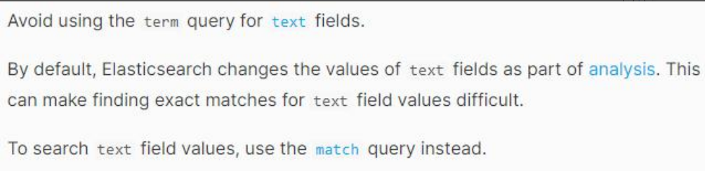
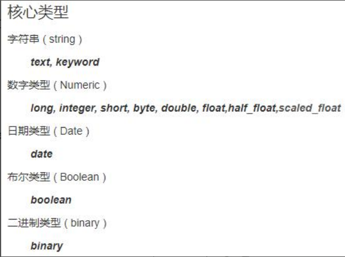
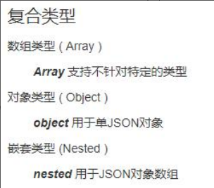
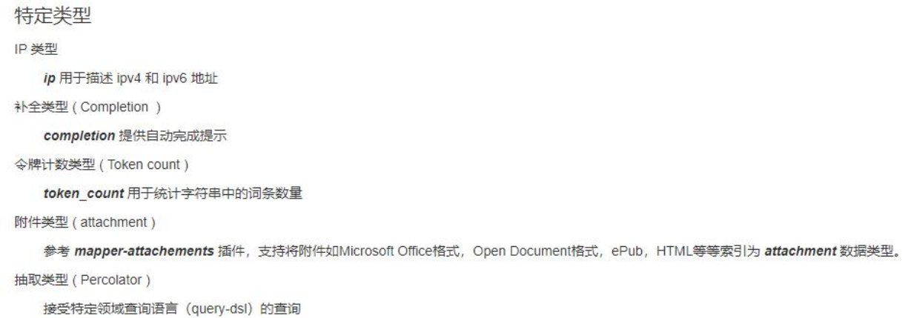
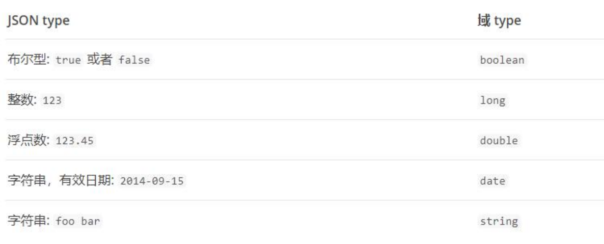
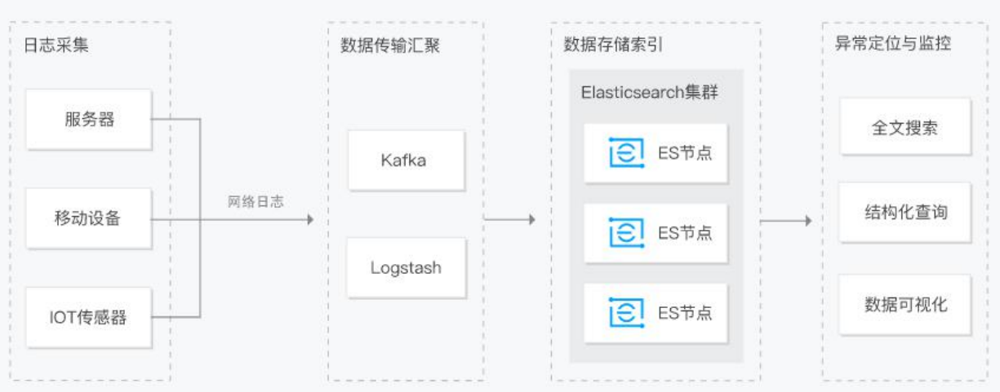
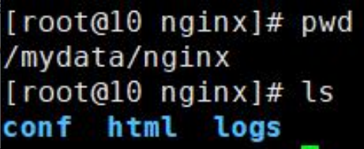

# ElasticSearch

## 简介

https://www.elastic.co/cn/what-is/elasticsearch

全文搜索属于最常见的需求，开源的 Elasticsearch 是目前全文搜索引擎的首选。
它可以快速地储存、搜索和分析海量数据。维基百科、Stack Overflow、Github 都采用它
Elastic 的底层是开源库 Lucene。但是，你没法直接用 Lucene，必须自己写代码去调用它的
接口。Elastic 是 Lucene 的封装，提供了 REST API 的操作接口，开箱即用。

REST API：天然的跨平台。

官方文档：https://www.elastic.co/guide/en/elasticsearch/reference/current/index.html

官方中文：https://www.elastic.co/guide/cn/elasticsearch/guide/current/foreword_id.html

社区中文：https://es.xiaoleilu.com/index.html

http://doc.codingdict.com/elasticsearch/0/

## 基本概念

### Index（索引）

动词，相当于 MySQL 中的 insert；

名词，相当于 MySQL 中的 Database

### Type（类型）

在 Index（索引）中，可以定义一个或多个类型。

类似于 MySQL 中的 Table；每一种类型的数据放在一起；

### Document（文档）

保存在某个索引（Index）下，某种类型（Type）的一个数据（Document），文档是 JSON 格 式的，Document 就像是 MySQL 中的某个 Table
里面的内容；

### 倒排索引机制


## Docker 安装 Es

### 下载镜像文件

```docker
#存储和检索数据
docker pull elasticsearch:8.6.2
#可视化检索数据
docker pull kibana:8.6.2 
```

### 创建实例

#### ElasticSearch

```shell
mkdir -p /mydata/elasticsearch/config
mkdir -p /mydata/elasticsearch/data
echo "http.host: 0.0.0.0" >> /mydata/elasticsearch/config/elasticsearch.yml
# 保证权限 
chmod -R 777 /mydata/elasticsearch/ 
docker run --name elasticsearch -p 9200:9200 -p 9300:9300 \
-e "discovery.type=single-node" \
-e ES_JAVA_OPTS="-Xms64m -Xmx512m" \
-v /mydata/elasticsearch/config/elasticsearch.yml:/usr/share/elasticsearch/config/elasticsearch.yml \
-v /mydata/elasticsearch/data:/usr/share/elasticsearch/data \
# 以后再外面装好插件重启即可
-v /mydata/elasticsearch/plugins:/usr/share/elasticsearch/plugins \
-d elasticsearch:8.6.2
```

::: tip 特别注意
-e ES_JAVA_OPTS="-Xms64m -Xmx256m" 测试环境下，设置 ES 的初始内存和最大内存，否则导致过大启动不了 ES
:::

#### Kibana

```docker
docker run --name kibana -e ELASTICSEARCH_HOSTS=http://192.168.56.10:9200 -p 5601:5601 -d kibana:8.6.2
```

::: tip
http://192.168.56.10:9200 一定改为自己虚拟机的地址
:::

## 初步检索

### _cat

```json
GET /_cat/nodes：查看所有节点
GET /_cat/health：查看 es 健康状况
GET /_cat/master：查看主节点
GET /_cat/indices：查看所有索引 show databases;
```

### 索引一个文档（保存）

保存一个数据，保存在哪个索引的哪个类型下，指定用哪个唯一标识

```json
# 在 customer 索引下的 external 类型下保存 1 号数据为
PUT customer/external/1；
PUT customer/external/1
{
"name": "John Doe"
}
```

PUT 和 POST 都可以

- POST 新增。如果不指定 id，会自动生成 id。指定 id 就会修改这个数据，并新增版本号
- PUT 可以新增可以修改。PUT 必须指定 id；由于 PUT 需要指定 id，我们一般都用来做修改操作，不指定 id 会报错。

### 查询文档

- GET customer/external/1
  结果：

```json
{
  "_index": "customer",
  //在哪个索引
  "_type": "external",
  //在哪个类型
  "_id": "1",
  //记录 id
  "_version": 2,
  //版本号
  "_seq_no": 1,
  //并发控制字段，每次更新就会+1，用来做乐观锁
  "_primary_term": 1,
  //同上，主分片重新分配，如重启，就会变化
  "found": true,
  "_source": {
    //真正的内容
    "name": "John Doe"
  }
}
```

更新携带 ?if_seq_no=0&if_primary_term=1

### 更新文档

```json
POST customer/external/1/_update
{
  "doc": {
    "name": "John Doew"
  }
}
```

或者

```json
POST customer/external/1
{
  "name": "John Doe2"
}
```

或者

```json
PUT customer/external/1
{
  "name": "John Doe"
}
```

- 不同：
  POST 操作会对比源文档数据，如果相同不会有什么操作，文档 version 不增加
  PUT 操作总会将数据重新保存并增加 version 版本；
  带_update 对比元数据如果一样就不进行任何操作。
  ::: info 看场景
  对于大并发更新，不带 update；
  对于大并发查询偶尔更新，带 update；对比更新，重新计算分配规则。
  :::
- 更新同时增加属性
  ```json
  POST customer/external/1/_update
  { 
	  "doc": { 
		  "name": "Jane Doe", "age": 20 
	  }
  }
  ```
  PUT 和 POST 不带_update 也可以

### 删除文档&索引

- DELETE customer/external/1
- DELETE customer

### bulk 批量 API

- POST customer/external/_bulk
  ```json
  {"index":{"_id":"1"}}
  {"name": "John Doe" }
  {"index":{"_id":"2"}}
  {"name": "Jane Doe" }
  ```
  复杂实例：
  ```json
  POST /_bulk
  { "delete": { "_index": "website", "_type": "blog", "_id": "123" }}
  { "create": { "_index": "website", "_type": "blog", "_id": "123" }}
  { "title": "My first blog post" }
  { "index": { "_index": "website", "_type": "blog" }}
  { "title": "My second blog post" }
  { "update": { "_index": "website", "_type": "blog", "_id": "123", "_retry_on_conflict" : 3} }
  { "doc" : {"title" : "My updated blog post"} }
  ```
  bulk API 以此按顺序执行所有的 action（动作）。如果一个单个的动作因任何原因而失败，它将继续处理它后面剩余的动作。当 bulk API
  返回时，它将提供每个动作的状态（与发送的顺序相同），所以您可以检查是否一个指定的动作是不是失败了。

### 样本测试数据

我准备了一份顾客银行账户信息的虚构的 JSON 文档样本。每个文档都有下列的 schema（模式）:

```json
 {
  "account_number": 0,
  "balance": 16623,
  "firstname": "Bradshaw",
  "lastname": "Mckenzie",
  "age": 29,
  "gender": "F",
  "address": "244 Columbus Place",
  "employer": "Euron",
  "email": "bradshawmckenzie@euron.com",
  "city": "Hobucken",
  "state": "CO"
}
```

https://github.com/elastic/elasticsearch/blob/master/docs/src/test/resources/accounts.json?raw=true 导入测试数据

```json
POST bank/account/_bulk
测试数据
```

## 进阶检索

### SearchAPI

ES 支持两种基本方式检索 :

- 一个是通过使用 REST request URI 发送搜索参数（uri+检索参数）
- 另一个是通过使用 REST request body 来发送它们（uri+请求体）

#### 检索信息

- 一切检索从_search 开始
	- GET bank/_search 检索 bank 下所有信息，包括 type 和 docs
	- GET bank/_search?q=*&sort=account_number:asc 请求参数方式检索
- 响应结果解释：
	- took - Elasticsearch 执行搜索的时间（毫秒）
	- time_out - 告诉我们搜索是否超时
	- _shards - 告诉我们多少个分片被搜索了，以及统计了成功/失败的搜索分片
	- hits - 搜索结果
	- hits.total - 搜索结果
	- hits.hits - 实际的搜索结果数组（默认为前 10 的文档）
	- sort - 结果的排序 key（键）（没有则按 score 排序）
	- score 和 max_score –相关性得分和最高得分（全文检索用）
- uri+请求体进行检索
  ```json
  GET bank/_search
  { 
	  "query": { 
		  "match_all": {}
	  },
	  "sort": [{ 
		  "account_number": { 
			  "order": "desc"
		  }
	  }]
  }
  ```

需要了解，一旦搜索的结果被返回，Elasticsearch 就完成了这次请求，并且不会维护任何服务端的资源或者结果的 cursor（游标）

### Query DSL

#### 基本语法格式

Elasticsearch 提供了一个可以执行查询的 Json 风格的 DSL（domain-specific language 领域特定语言）。这个被称为 Query
DSL。该查询语言非常全面，并且刚开始的时候感觉有点复杂，真正学好它的方法是从一些基础的示例开始的。

- 一个查询语句 的典型结构
  ```json
  {
	 QUERY_NAME: {
		 ARGUMENT: VALUE, ARGUMENT: VALUE,... 
	 }
  }
  ```
- 如果是针对某个字段，那么它的结构如下：
  ```json
  {
	 QUERY_NAME: {
		 FIELD_NAME: {
			 ARGUMENT: VALUE, ARGUMENT: VALUE,... 
		 }
	 }
  }
  ```
  ```json
  GET bank/_search
  { 
	 "query": { 
		 "match_all": {}
	 },
	 "from": 0, 
	 "size": 5, 
	 "sort": [{ 
		 "account_number": { 
			 "order": "desc"
		 }
	 }]
  }
  ```
- query 定义如何查询，
- match_all 查询类型【代表查询所有的所有】，es 中可以在 query 中组合非常多的查询类型完成复杂查询
- 除了 query 参数之外，我们也可以传递其它的参数以改变查询结果。如 sort，size
- from+size 限定，完成分页功能
- sort 排序，多字段排序，会在前序字段相等时后续字段内部排序，否则以前序为准

#### 返回部分字段

```json
GET bank/_search
{
  "query": {
    "match_all": {}
  },
  "from": 0,
  "size": 5,
  "_source": [
    "age",
    "balance"
  ]
}
```

#### match【匹配查询】

- 基本类型（非字符串），精确匹配
  ```json
  GET bank/_search
  { 
	"query": { 
		"match": { 
			"account_number": "20"
		}
	}
  }
  ```
  match 返回 account_number=20 的
- 字符串，全文检索
  ```json
  GET bank/_search
  { 
	"query": { 
		"match": { 
			"address": "mill"
		}
	}
  }
  ```
  最终查询出 address 中包含 mill 单词的所有记录
  match 当搜索字符串类型的时候，会进行全文检索，并且每条记录有相关性得分。
- 字符串，多个单词（分词+全文检索）
  ```json
  GET bank/_search
  { 
	"query": { 
		"match": { 
			"address": "mill road"
		}
	}
  }
  ```
  最终查询出 address 中包含 mill 或者 road 或者 mill road 的所有记录，并给出相关性得分

#### match_phrase【短语匹配】

将需要匹配的值当成一个整体单词（不分词）进行检索

```json
GET bank/_search
{
  "query": {
    "match_phrase": {
      "address": "mill road"
    }
  }
}
```

查出 address 中包含 mill road 的所有记录，并给出相关性得分

#### multi_match【多字段匹配】

```json
GET bank/_search
{
  "query": {
    "multi_match": {
      "query": "mill",
      "fields": [
        "state",
        "address"
      ]
    }
  }
}
```

state 或者 address 包含 mill

#### bool【复合查询】

bool 用来做复合查询：复合语句可以合并 任何 其它查询语句，包括复合语句，了解这一点是很重要的。这就意味着，复合语句之间可以互相嵌套，可以表达非常复杂的逻辑。

- must：必须达到 must 列举的所有条件
  ```json
  GET bank/_search
  { 
	"query": { 
		"bool": { 
			"must": [{ 
				"match": { 
					"address": "mill" 
				} 
			},
			{ 
				"match": { 
					"gender": "M" 
				} 
			}]
		}
	}
  }
  ```
- should：应该达到 should 列举的条件，如果达到会增加相关文档的评分，并不会改变查询的结果。如果 query 中只有 should
  且只有一种匹配规则，那么 should 的条件就会被作为默认匹配条件而去改变查询结果
  ```json
  GET bank/_search
  { 
	  "query": { 
		  "bool": { 
			  "must": [{ 
				  "match": { 
					  "address": "mill" 
				  } 
			  }, 
			  { 
				  "match": { 
					  "gender": "M" 
				  } 
			  }],
			  "should": [{
				  "match": { 
					  "address": "lane" 
				  }
			  }]
		  }
	  }
  }
  ```
- must_not 必须不是指定的情况
  ```json
  GET bank/_search
  { 
	  "query": { 
		  "bool": { 
			  "must": [{ 
				  "match": { 
					  "address": "mill" 
				  } 
			  }, 
			  { 
				  "match": { 
					  "gender": "M" 
				  } 
			  }],
			  "should": [{
				  "match": { 
					  "address": "lane" 
				  }
			  }],
			  "must_not": [{
				  "match": { 
					  "email": "baluba.com" 
				  }
			  }]
		  }
	  }
  }
  ```
  address 包含 mill，并且 gender 是 M，如果 address 里面有 lane 最好不过，但是 email 必须不包含 baluba.com

  

#### filter【结果过滤】

并不是所有的查询都需要产生分数，特别是那些仅用于 “filtering”（过滤）的文档。为了不计算分数 Elasticsearch 会自动检查场景并且优化查询的执行。

```json
GET bank/_search
{
  "query": {
    "bool": {
      "must": [
        {
          "match": {
            "address": "mill"
          }
        }
      ],
      "filter": {
        "range": {
          "balance": {
            "gte": 10000,
            "lte": 20000
          }
        }
      }
    }
  }
}
```

#### term

和 match 一样。匹配某个属性的值。全文检索字段用 match，其他非 text 字段匹配用 term。



```json
GET bank/_search
{
  "query": {
    "bool": {
      "must": [
        {
          "term": {
            "age": {
              "value": "28"
            }
          }
        },
        {
          "match": {
            "address": "990 Mill Road"
          }
        }
      ]
    }
  }
}
```

#### aggregations（执行聚合）

聚合提供了从数据中分组和提取数据的能力。最简单的聚合方法大致等于 SQL GROUP BY 和 SQL 聚合函数。在 Elasticsearch 中，您有执行搜索返回hits（命中结果），并且同时返回聚合结果，把一个响应中的所有hits（命中结果）分隔开的能力。这是非常强大且有效的，您可以执行查询和多个聚合，并且在一次使用中得到各自的（任何一个的）返回结果，使用一次简洁和简化的API 来避免网络往返。

- 搜索 address 中包含 mill 的所有人的年龄分布以及平均年龄，但不显示这些人的详情。
  ```json
  GET bank/_search
  { 
	  "query": { 
		  "match": { 
			  "address": "mill"
		  }
	  },
	  "aggs": { 
		  "group_by_state": { 
			  "terms": { 
				  "field": "age"
			  }
		  },
		  "avg_age": { 
			  "avg": {
				  "field": "age"
			  }
		  }
	  },
	  "size": 0
  }
  ```
	- size：0 不显示搜索数据
	- aggs：执行聚合。聚合语法如下
	- "aggs": { "aggs_name 这次聚合的名字，方便展示在结果集中": { "AGG_TYPE 聚合的类型（avg,term,terms）": {}}}
	- 复杂：按照年龄聚合，并且请求这些年龄段的这些人的平均薪资
	  ```json
	  GET bank/account/_search
	  {
		  "query": {
			  "match_all": {}
		  },
		  "aggs": {
			  "age_avg": {
				  "terms": { 
					  "field": "age", 
					  "size": 1000
				  },
				  "aggs": {
					  "banlances_avg": { 
						  "avg": { 
							  "field": "balance"
						  }
					  }
				  }
			  }
		  },
		  "size": 1000
	  }
	  ```
	- 复杂：查出所有年龄分布，并且这些年龄段中 M 的平均薪资和 F 的平均薪资以及这个年龄段的总体平均薪资
	  ```json
	  GET bank/account/_search
	  {
		  "query": {
			  "match_all": {}
		  },
		  "aggs": {
			  "age_agg": {
				  "terms": {
					  "field": "age",
					  "size": 100
				  },
				  "aggs": {
					  "gender_agg": {
					  "terms": {
						  "field": "gender.keyword",
						  "size": 100
					  },
					  "aggs": {
						  "balance_avg": {
							  "avg": {
								  "field": "balance"
							  }
						  }
					  }
				  },
				  "balance_avg": {
					  "avg": {
						  "field": "balance"
					  }
				  }
			  }
		  }
		},
		"size": 1000
	  }
	  ```

### Mapping

#### 字段类型






#### 映射
Mapping（映射）

Mapping 是用来定义一个文档（document），以及它所包含的属性（field）是如何存储和索引的。比如，使用 mapping 来定义：

- 哪些字符串属性应该被看做全文本属性（full text fields）。
- 哪些属性包含数字，日期或者地理位置。
- 文档中的所有属性是否都能被索引（_all 配置）。
- 日期的格式。
- 自定义映射规则来执行动态添加属性。
- 查看 mapping 信息：
  GET bank/_mapping
- 修改 mapping 信息
  https://www.elastic.co/guide/en/elasticsearch/reference/current/mapping.html
  自动猜测的映射类型
  

#### 新版本改变

- Es7 及以上移除了 type 的概念。
	- 关系型数据库中两个数据表示是独立的，即使他们里面有相同名称的列也不影响使用，但 ES 中不是这样的。elasticsearch 是基于
	  Lucene 开发的搜索引擎，而 ES 中不同 type下名称相同的 filed 最终在 Lucene 中的处理方式是一样的。
		- 两个不同 type 下的两个 user_name，在 ES 同一个索引下其实被认为是同一个 filed，你必须在两个不同的 type 中定义相同的
		  filed 映射。否则，不同 type 中的相同字段名称就会在处理中出现冲突的情况，导致 Lucene 处理效率下降。
		- 去掉 type 就是为了提高 ES 处理数据的效率。
- Elasticsearch 7.x
	- URL 中的 type 参数为可选。比如，索引一个文档不再要求提供文档类型。
- Elasticsearch 8.x
	- 不再支持 URL 中的 type 参数。
	  解决：
		- 将索引从多类型迁移到单类型，每种类型文档一个独立索引
		- 将已存在的索引下的类型数据，全部迁移到指定位置即可。详见数据迁移
1. 创建索引并指定映射
	```json
	PUT /my-index
	{ 
	  "mappings": { 
		  "properties": {
			  "age": { 
				  "type": "integer" 
			  }, 
			  "email": { 
				  "type": "keyword" 
			  }, 
			  "name": { 
				  "type": "text" 
			  }
		  }
	  }
	}
	```
2. 添加新的字段映射
	```json
	PUT /my-index/_mapping
	{ 
	  "properties": { 
		  "employee-id": { 
			  "type": "keyword", 
			  "index": false
		  }
	  }
	}
	```
3. 更新映射
	对于已经存在的映射字段，我们不能更新。更新必须创建新的索引进行数据迁移
4. 数据迁移
	先创建出 new_twitter 的正确映射。然后使用如下方式进行数据迁移
	```json
	POST _reindex [固定写法]
	{ 
	  "source": { 
		  "index": "twitter"
	  },
	  "dest": { 
		  "index": "new_twitter"
	  }
	}
	```
	将旧索引的 type 下的数据进行迁移
	```json
	POST _reindex
	{ 
	  "source": {
		  "index": "twitter", 
		  "type": "tweet"
	  },
	  "dest": { 
		  "index": "tweets"
	  }
	}
	```

#### 分词
一个 tokenizer（分词器）接收一个字符流，将之分割为独立的 tokens（词元，通常是独立的单词），然后输出 tokens 流。例如，whitespace tokenizer 遇到空白字符时分割文本。它会将文本 "Quick brown fox!" 分割为 [Quick, brown, fox!]。该 tokenizer（分词器）还负责记录各个 term（词条）的顺序或 position 位置（用于 phrase 短语和 word proximity 词近邻查询），以及term（词条）所代表的原始 word（单词）的 start（起始）和 end（结束）的 character offsets（字符偏移量）（用于高亮显示搜索的内容）。Elasticsearch 提供了很多内置的分词器，可以用来构建 custom analyzers（自定义分词器）。
1. 安装 ik 分词器
	注意：不能用默认 elasticsearch-plugin install xxx.zip 进行自动安装
	https://github.com/medcl/elasticsearch-analysis-ik/releases?after=v6.4.2 对应 es 版本安装
	```shell
	进入 es 容器内部 plugins 目录
	docker exec -it 容器 id /bin/bash
	wget
	https://github.com/medcl/elasticsearch-analysis-ik/releases/download/v8.6.2/elasticsearch-anal
	ysis-ik-8.6.2.zip
	unzip 下载的文件
	rm –rf *.zip
	mv elasticsearch/ ik
	可以确认是否安装好了分词器
	cd ../bin
	elasticsearch plugin list：即可列出系统的分词器
	```
2. 测试分词器
	- 使用默认
	    ```json
		POST _analyze
		{ 
			"text": "我是中国人"
		}
		```
	  请观察结果
	- 使用分词器
	    ```json
		POST _analyze
		{ 
			"analyzer": "ik_smart", 
			"text": "我是中国人"
		}
		```
	  请观察结果
	- 另外一个分词器ik_max_word
	    ```json
		POST _analyze
		{ 
			"analyzer": "ik_max_word", 
			"text": "我是中国人"
		}
		```
	  请观察结果
	  能够看出不同的分词器，分词有明显的区别，所以以后定义一个索引不能再使用默认的 mapping 了，要手工建立 mapping,
	  因为要选择分词器。

3. 自定义词库

	修改/usr/share/elasticsearch/plugins/ik/config/中的 IKAnalyzer.cfg.xml

	/usr/share/elasticsearch/plugins/ik/config
	```xml
	<?xml version="1.0" encoding="UTF-8"?>
	<!DOCTYPE properties SYSTEM "http://java.sun.com/dtd/properties.dtd">
	<properties>
	   <comment>IK Analyzer 扩展配置</comment>
	   <!--用户可以在这里配置自己的扩展字典 -->
	   <entry key="ext_dict"></entry>
	   <!--用户可以在这里配置自己的扩展停止词字典-->
	   <entry key="ext_stopwords"></entry>
	   <!--用户可以在这里配置远程扩展字典 -->
	   <entry key="remote_ext_dict">http://192.168.128.130/fenci/myword.txt</entry>
	   <!--用户可以在这里配置远程扩展停止词字典-->
	   <!-- <entry key="remote_ext_stopwords">words_location</entry> -->
	</properties>
	```
	原来的 xml
	```xml
	<?xml version="1.0" encoding="UTF-8"?>
	<!DOCTYPE properties SYSTEM "http://java.sun.com/dtd/properties.dtd">
	<properties>
	   <comment>IK Analyzer 扩展配置</comment>
	   <!--用户可以在这里配置自己的扩展字典 -->
	   <entry key="ext_dict"></entry>
	   <!--用户可以在这里配置自己的扩展停止词字典-->
	   <entry key="ext_stopwords"></entry>
	   <!--用户可以在这里配置远程扩展字典 -->
	   <!-- <entry key="remote_ext_dict">words_location</entry> -->
	   <!--用户可以在这里配置远程扩展停止词字典-->
	   <!-- <entry key="remote_ext_stopwords">words_location</entry> -->
	</properties>
	```
	按照标红的路径利用 nginx 发布静态资源,按照请求路径，创建对应的文件夹以及文件，放在nginx 的 html 下

	

	然后重启 es 服务器，重启 nginx。

	在 kibana 中测试分词效果

	

	更新完成后，es 只会对新增的数据用新词分词。历史数据是不会重新分词的。如果想要历史数据重新分词。需要执行：

	POST my_index/_update_by_query?conflicts=proceed

## Elasticsearch-Rest-Client

- 9300：TCP
	- spring-data-elasticsearch:transport-api.jar；
		- springboot 版本不同， transport-api.jar 不同，不能适配 es 版本
		- 7.x 已经不建议使用，8 以后就要废弃
- 9200：HTTP
	- JestClient：非官方，更新慢
	- RestTemplate：模拟发 HTTP 请求，ES 很多操作需要自己封装，麻烦
	- HttpClient：同上
	- Elasticsearch-Rest-Client：官方 RestClient，封装了 ES 操作，API 层次分明，上手简单
	  最终选择 Elasticsearch-Rest-Client（elasticsearch-rest-high-level-client）
	  https://www.elastic.co/guide/en/elasticsearch/client/java-rest/current/java-rest-high.html

1. SpringBoot 整合

	```pom
	<dependency>
		<groupId>org.elasticsearch.client</groupId>
		<artifactId>elasticsearch-rest-high-level-client</artifactId>
		<version>8.6.2</version>
	</dependency>
	```

2. 配置

	```java
	@Bean
	RestHighLevelClient client() {
		RestClientBuilder builder = RestClient.builder(new HttpHost("192.168.56.10", 9200, "http"));
		return new RestHighLevelClient(builder);
	}
	```

3. 使用
	参照官方文档：

	```java
	@Test
	void test1() throws IOException {
		Product product = new Product();
		product.setSpuName("华为");
		product.setId(10L);
		IndexRequest request = new IndexRequest("product").id("20").source("spuName","华为","id",20L);
		try {
			IndexResponse response = client.index(request, RequestOptions.DEFAULT);
			System.out.println(request.toString());
			IndexResponse response2 = client.index(request, RequestOptions.DEFAULT);
		} catch (ElasticsearchException e) {
			if (e.status() == RestStatus.CONFLICT) {
			}
		}
	}
	```
	
## 附录-安装 nginx

- 随便启动一个 nginx 实例，只是为了复制出配置
- docker run -p 80:80 --name nginx -d nginx:1.10
- 将容器内的配置文件拷贝到当前目录：docker container cp nginx:/etc/nginx .  别忘了后面的点
- 修改文件名称：mv nginx conf 把这个 conf 移动到/mydata/nginx 下
- 终止原容器：docker stop nginx
- 执行命令删除原容器：docker rm $ContainerId
- 创建新的 nginx；执行以下命令
    ```shell
    docker run -p 80:80 --name nginx \
    -v /mydata/nginx/html:/usr/share/nginx/html \
    -v /mydata/nginx/logs:/var/log/nginx \
    -v /mydata/nginx/conf:/etc/nginx \
    -d nginx:1.10
    ```
  	
- 给 nginx 的 html 下面放的所有资源可以直接访问；
